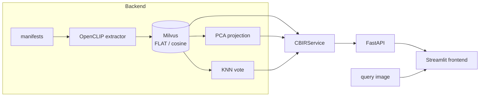

# Vector-Space Explorer for Images

> Content-Based Image Retrieval (CBIR): index image embeddings into a vector
> database and explore the vector space (PCA + KNN) through a FastAPI and
> Streamlit stack.

A Content-Based Image Retrieval system that indexes image embeddings into a
vector database and lets you **explore the embedding space visually**: it
projects the indexed gallery to 2D/3D with PCA, lets you drop in a query image,
and shows where it lands relative to the class clusters, together with the class
a K-Nearest-Neighbours vote over its retrieved neighbours would assign it.

It is built for researchers who want to *see*, not just measure, whether their
retrieval and classification are behaving: does a query land inside the right
cluster, and do its nearest neighbours agree on its class?


> **Case study.** The system is generic and works with any image. The committed
> sample data comes from a maritime-surveillance project (TecGraf PUC-Rio /
> Embraer) that monitors vessels in Guanabara Bay, but nothing in the system is
> domain-specific. The long-term goal is retrieval-based auto-labeling of a
> large unlabeled image pool. This repository is the programming-project
> deliverable: a small, correct, end-to-end system.

## Highlights

- **Pluggable embedding models, kept consistent end to end.** Pick the model at
  index time; the collection remembers it, and every query is embedded with the
  *same* model (mixing embedding spaces is refused by design).
- **PCA projection with an exact query transform.** Unlike t-SNE/UMAP, PCA can
  place a brand-new query image in the *same* coordinate space as the gallery.
- **KNN class prediction.** A majority (optionally similarity-weighted) vote
  over the retrieved neighbours, shown with a confidence bar.
- **Three clean tiers:** a pure Python backend, a FastAPI service, and a
  Streamlit frontend that talks only to the API.
- **Runs out of the box.** A tiny committable sample (160 crops, 4 classes)
  plus a precomputed-embedding cache means you can demo it without the 33 GB
  image pool and without a GPU.

## Architecture



| Layer | Package | Responsibility |
| --- | --- | --- |
| Backend | `cbir/core`, `cbir/index`, `cbir/viz`, `cbir/knn.py` | Manifests, extraction, Milvus, PCA, KNN |
| Service | `cbir/service.py` | Orchestration + the model-consistency guarantee |
| API | `cbir/api` | Thin FastAPI over the service |
| Frontend | `cbir/app` | Streamlit vector-space explorer |
| Contracts | `cbir/models.py` | Pydantic v2 models shared by all layers |
| Observability | `cbir/observability.py` | Wide-event structured logging |

## Quickstart (local, with the committed sample)

```bash
uv sync                        # install everything
docker compose up -d           # start Milvus (etcd + minio + milvus + Attu)

# Reconstruct the demo collection from the precomputed cache (no GPU needed):
uv run cbir seed --collection cbir_sample --parquet cbir/sample_data/embeddings.parquet

# In two terminals:
uv run cbir api                # FastAPI on :8100
uv run cbir app                # Streamlit on :8501
```

Open <http://localhost:8501>, pick the `cbir_sample` collection, and upload one
of the crops from `cbir/sample_data/crops/` as a query.

To index from scratch instead of seeding (needs the model, ~30 s on CPU/MPS):

```bash
uv run cbir index --manifest cbir/sample_data/manifest.jsonl \
  --collection cbir_sample --model openclip-vit-b-32 --device auto
```

## Quickstart (Docker, full stack)

```bash
docker compose --profile app up -d --build   # Milvus + API + frontend
docker compose exec api cbir seed --collection cbir_sample
```

Frontend at <http://localhost:8501>, API at <http://localhost:8100/docs>,
Milvus admin (Attu) at <http://localhost:8000>.

## CLI

```text
cbir sample   Build the committable sample dataset (crops + manifest)
cbir index    Embed a manifest's crops and index them into Milvus
cbir export   Snapshot a collection's embeddings to a Parquet cache
cbir seed     Reconstruct a collection from a Parquet cache (no model needed)
cbir api      Run the FastAPI service
cbir app      Run the Streamlit frontend
```

Every command takes `--model` and `--device` (`auto` → CUDA → Apple MPS → CPU).
Available models: `openclip-vit-b-32` (default), `openclip-vit-b-16`.

## API

| Method | Path | Purpose |
| --- | --- | --- |
| GET | `/health` | Liveness |
| GET | `/models` | Available embedding models |
| GET | `/collections` | Indexed collections + their model + count |
| GET | `/collections/{name}/project?n_components=2\|3` | PCA coordinates of the gallery |
| POST | `/collections/{name}/query` | Upload an image → neighbours + KNN prediction + query coords |
| GET | `/crop?image_path=...` | Serve a gallery/hit image by manifest path |

## Development

```bash
uv run ruff check cbir/ tests/   # lint
uv run mypy cbir/                # type-check
uv run pytest                    # tests
```

## Repository layout

```text
cbir/            the system (backend, api, app, models, observability)
cbir/sample_data/  committable demo: 160 crops (4 classes) + manifest + embeddings.parquet
tests/           pytest suite (pure BE + API with a fake service)
docker-compose.yml, Dockerfile
archive/         frozen mvp proof-of-concept and historical design docs (reference only)
```

## License / provenance

Master's programming project (PUC, INF2102). Images and annotations belong to
the parent TecGraf/Embraer project and are not distributed here; only a small
derived sample of crops is committed for demonstration.
