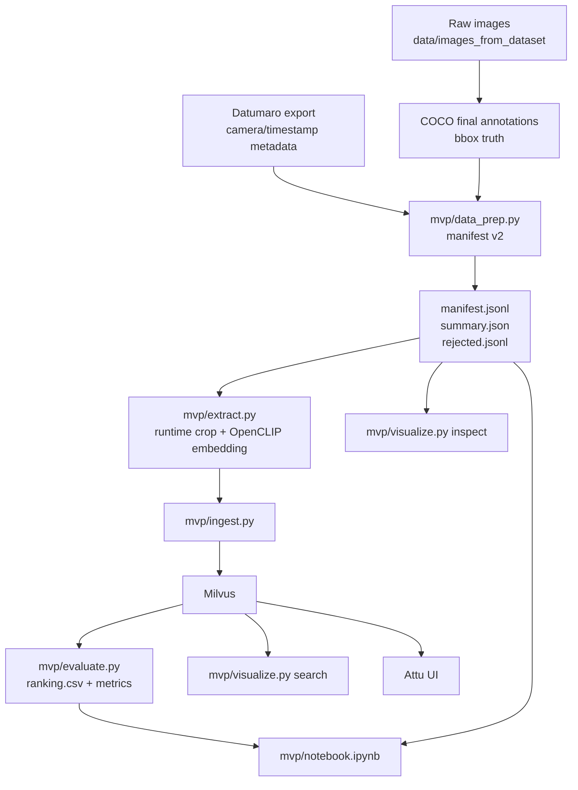
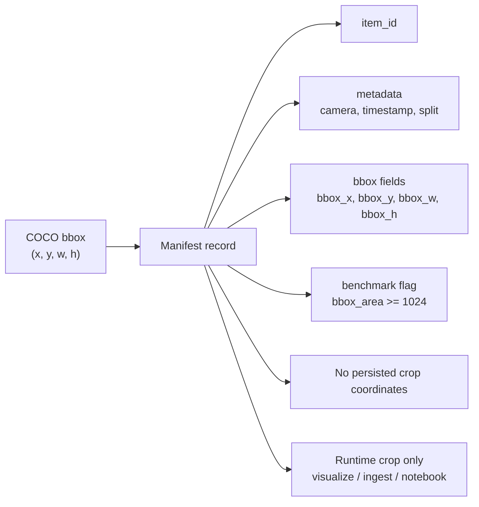
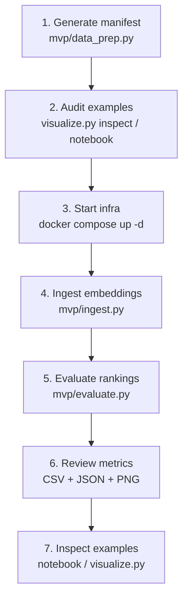
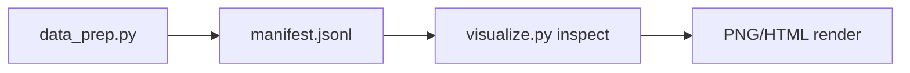
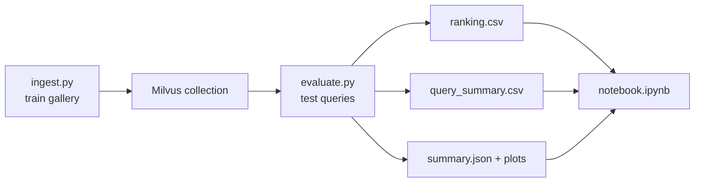
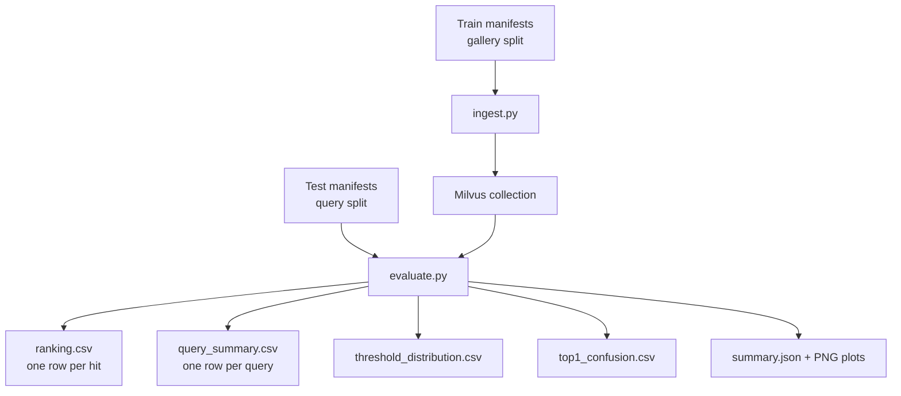

# MVP README

## Purpose

This `mvp/` directory contains the first end-to-end bbox-level CBIR baseline for the project.

The MVP is intentionally narrow. It does **not** try to solve the entire thesis workflow yet. Instead, it answers a more controlled question:

> Given annotated vessel bounding boxes for a strong class such as `Traineira`, can the system derive runtime crops, extract image embeddings, store them in Milvus, query nearest neighbors, and inspect the results visually?

The guiding principle of this MVP is to make the first retrieval baseline:

- bbox-level
- reproducible
- easy to inspect
- narrow enough to interpret

The persisted canonical unit is the **raw bbox annotation**, not a padded crop.

## What Exists Today

| Component | File | Responsibility |
| --- | --- | --- |
| Data contract builder | `mvp/data_prep.py` | Derives the bbox-level class manifest from the final COCO and Datumaro exports |
| Embedder | `mvp/extract.py` | Loads `OpenCLIP ViT-B/32`, derives runtime crops, and extracts normalized embeddings |
| Milvus helper | `mvp/db.py` | Connects to Milvus, recreates collections, inserts rows, and performs vector search |
| Ingestion pipeline | `mvp/ingest.py` | Reads the manifest, extracts embeddings, and inserts into Milvus with a producer-consumer flow |
| Ranking evaluator | `mvp/evaluate.py` | Queries Milvus from held-out manifests and writes ranking/summary artifacts |
| Deterministic sampler | `mvp/sampling.py` | Provides stratified per-class sampling by class, camera, and size bucket |
| Visual inspection/search renderer | `mvp/visualize.py` | Renders bbox inspection and top-k search results outside the notebook |
| Notebook | `mvp/notebook.ipynb` | Loads evaluation artifacts and supports qualitative bbox inspection |
| Tutorial | `mvp/HOWTOUSE.md` | Operational usage guide with copy-paste commands |

## MVP Scope

This MVP currently covers:

- bbox-level data preparation
- runtime crop derivation
- external off-the-shelf embeddings
- Milvus standalone via Docker Compose
- Attu UI via Docker Compose
- notebook-first inspection
- script-based inspection and search rendering
- smoke-test ingestion into the vector database
- single-class similarity calibration (`exp01`)
- first mixed-class discriminative benchmark (`exp02`)

This MVP intentionally does **not** yet cover:

- UMAP/HDBSCAN clustering
- detector-derived embeddings
- API/CLI package structure in `cbir/`
- dashboard beyond Attu
- productionized experiment tracking

## Core Assumptions

| Topic | Current decision |
| --- | --- |
| Canonical persisted unit | Raw COCO bbox |
| First class | `Traineira` |
| First benchmark slice | `medium+` (`bbox_area >= 1024`) |
| Default crop policy | `padding_ratio = 0.0` |
| Baseline embedding model | `OpenCLIP ViT-B/32` with `openai` weights |
| Vector DB | Milvus standalone |
| Search metric | Cosine similarity over normalized vectors |
| First inspection surface | Jupyter notebook |
| First external UI | Attu |
| First calibration experiment | `Traineira` train gallery -> `Traineira` test queries |
| First discriminative experiment | `Traineira + Lancha / Iate` train gallery -> test queries |

## High-Level Architecture



## Data Contract

The most important design correction in this MVP is the data contract:

- the manifest persists the raw bbox;
- crops are derived only at runtime;
- `padding_ratio` is an execution parameter, not part of the persisted dataset unit.



## End-to-End Flow



## Usage Paths

### Path 1: Fast qualitative audit

Use this when the goal is to inspect whether the annotated bbox is visually acceptable before retrieval.



### Path 2: Small ingestion smoke test

Use this when the goal is to verify that the model, Milvus schema, and write path all work together.


### Path 3: Evaluation-first exploration

Use this when the goal is to compare experiments with a reproducible protocol.



## Manifest Artifacts

For a class such as `Traineira`, the current artifact layout is:

```text
data/cbir/traineira/v1/
├── manifest.jsonl
├── summary.json
└── rejected.jsonl
```

Each manifest record contains:

- `item_id`
- `target_class`
- `split`
- `idx_in_class_split`
- `annotation_id`
- `image_path`
- `image_filename`
- `image_id`
- `camera_id`
- `timestamp`
- `bbox_x`
- `bbox_y`
- `bbox_w`
- `bbox_h`
- `bbox_area`
- `size_bucket`
- `occluded`
- `difficult`
- `n_objects_in_frame`
- `other_labels_in_frame`
- `is_benchmark_candidate`

The manifest explicitly avoids persisting padded crop coordinates.

## Ingestion Design

The ingestion pipeline is deliberately simple.

1. Load and filter manifest records.
2. Derive crops at runtime from the bbox.
3. Encode the current batch with `OpenCLIP ViT-B/32`.
4. Normalize embeddings.
5. Push rows to a writer thread.
6. Insert batches into Milvus while the next batch is being encoded.

This is parallel enough for a first local MVP without introducing multiprocessing complexity.

The ingestion script now accepts repeated `--manifest` flags, so mixed-class collections can be created without merging files manually. When `--sample-per-class` is provided, the default strategy is deterministic stratified sampling by `target_class`, `camera_id`, and `size_bucket`.

## Evaluation Protocol

The evaluator uses a strict table grain:

- one query bbox produces `top_k` retrieved hits;
- `ranking.csv` has one row per retrieved hit;
- `query_summary.csv` has one row per query;
- `threshold_distribution.csv` aggregates score-threshold booleans by threshold, rank, query class, and hit class;
- `top1_confusion.csv` stores the top-1 class confusion matrix;
- `summary.json` records parameters, metrics, output paths, and leakage checks.



### Official MVP Experiments

| Experiment | Gallery | Query | Purpose | Interpretation |
| --- | --- | --- | --- | --- |
| `exp01` | `Traineira`, `train`, `medium+` | `Traineira`, `test`, `medium+` | Intra-class calibration | Score distribution and threshold coverage only |
| `exp02` | `Traineira + Lancha / Iate`, `train`, `medium+` | `Traineira + Lancha / Iate`, `test`, `medium+` | First discriminative benchmark | Class separation, precision@k, top-1 confusion, threshold precision/coverage |

Perfect class-match metrics in `exp01` are structurally expected because every indexed item belongs to the same class. The useful signal in `exp01` is score distribution, not classification quality.

For `exp02`, the key metrics are:

- `top1_accuracy`
- `precision_at_5`
- `precision_at_10`
- `precision_at_30`
- `MRR`
- `thresholded_precision`
- `thresholded_coverage`
- top-1 confusion matrix

Leakage checks are written to `summary.json`. In official `train -> test` experiments, `remaining_self_hits` should be `0`.

## Milvus and Attu

The root [docker-compose.yml](/Users/gabriel/_pgms/personal/cbir/docker-compose.yml) now provides:

- `etcd`
- `minio`
- `milvus`
- `attu`

Ports:

- Milvus gRPC: `19530`
- Milvus health: `9091`
- Attu UI: `8000`

Important note:

- `MinIO` is **not** being used to mirror the raw image dataset.
- In this setup, `MinIO` is the object storage dependency required by Milvus itself.
- Raw images remain on local disk under `data/images_from_dataset`.

## What Has Already Been Validated

The following has already been exercised successfully in this MVP:

- manifest v2 generation for `Traineira`
- manifest summary and rejection logging
- runtime bbox inspection rendering
- OpenCLIP embedding extraction
- embedding normalization
- Milvus collection creation
- row insertion into Milvus
- vector search in Milvus
- top-k search rendering to image
- Docker Compose stack with Milvus and Attu
- deterministic multiclass ingestion interface
- ranking artifact interface for evaluation

## Practical Entry Points

If you want to use the MVP right now, start here:

- Operational tutorial: [HOWTOUSE.md](/Users/gabriel/_pgms/personal/cbir/mvp/HOWTOUSE.md)
- Exploratory UI: [notebook.ipynb](/Users/gabriel/_pgms/personal/cbir/mvp/notebook.ipynb)
- Fast inspection script: [visualize.py](/Users/gabriel/_pgms/personal/cbir/mvp/visualize.py)
- Ingestion script: [ingest.py](/Users/gabriel/_pgms/personal/cbir/mvp/ingest.py)

## Current Limitations

The MVP still has important limitations.

### 1. Precision metrics are not meaningful in a single-class collection

If all indexed vectors come from the same class, class-match precision becomes structurally trivial. A mixed-class collection is needed for a more informative retrieval evaluation.

### 2. Clustering is not implemented yet

The roadmap already points toward:

- `UMAP` for 2D projection
- `HDBSCAN` for grouping by class

That next step still needs to be added on top of the current embeddings.

### 3. Detector-derived embeddings are still a later experiment

The current model is an external generic visual embedder. The comparison against embeddings derived from an in-house YOLO backbone still does not exist.

### 4. The `cbir/` package architecture has not started yet

This MVP is still standalone by design. It is not yet the structured project package described in the root roadmap.

## What Is Missing Now

The main missing pieces, in priority order, are these:

1. Run and inspect the full `exp02` benchmark after the smoke test.
2. Decide whether `Lancha / Iate` is enough as the first negative class or whether `Rebocador` should be added next.
3. Implement **UMAP + HDBSCAN** on the stored embeddings, class by class.
4. Compare strong classes such as `Traineira`, `Rebocador`, `Lancha / Iate`, and `Navio de Carga Geral`.
5. Test whether clustering behaves differently by **camera**.
6. Only after that, add **YOLO-derived embeddings** as the next experimental baseline.
7. Later, migrate the learnings from `mvp/` into the real `cbir/` package architecture.

## Short Summary

This MVP is already a working bbox-level CBIR baseline:

- annotated bbox in
- runtime crop out
- OpenCLIP embedding out
- Milvus storage and search working
- visual inspection and top-k rendering working

What remains now is not “making it exist”, but making it **scientifically useful**:

- mixed-class evaluation
- clustering
- camera-aware analysis
- model comparison
