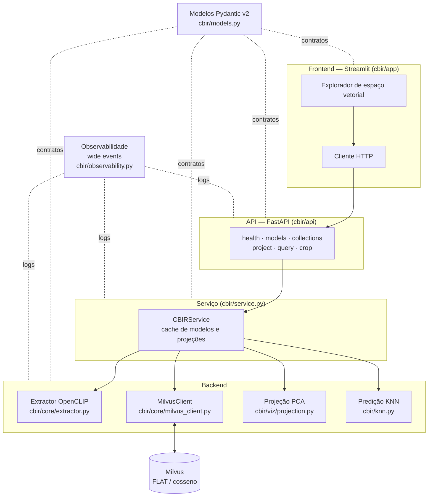
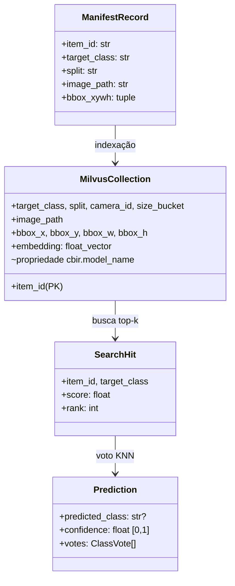
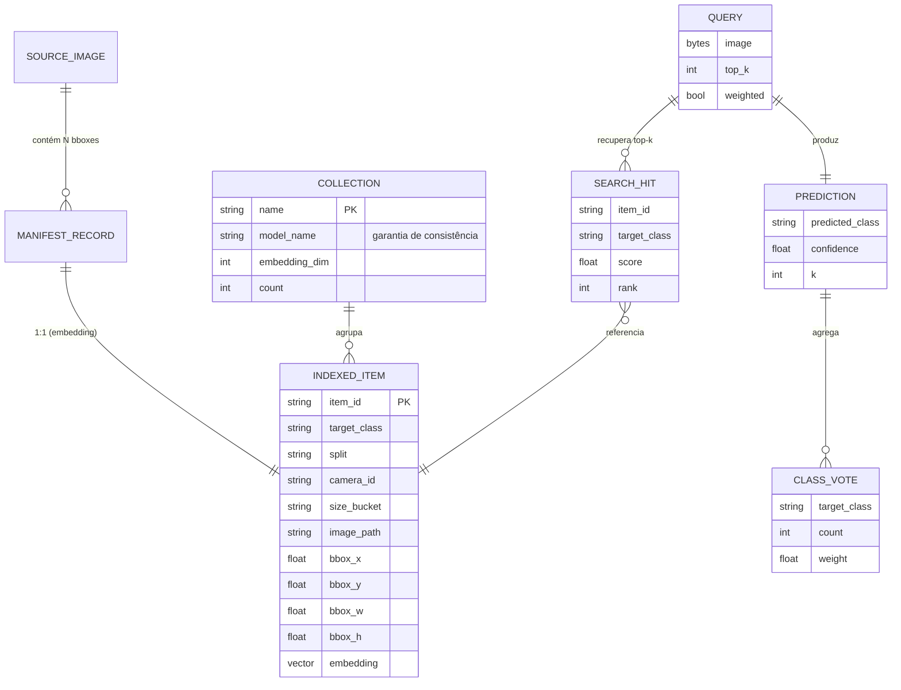
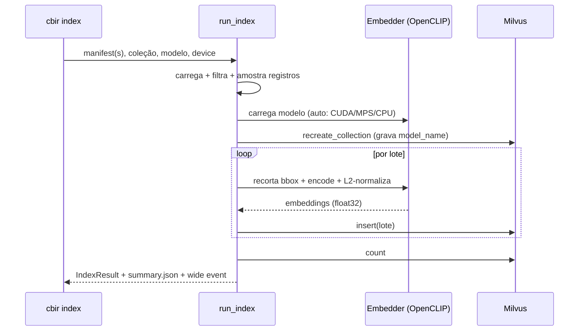
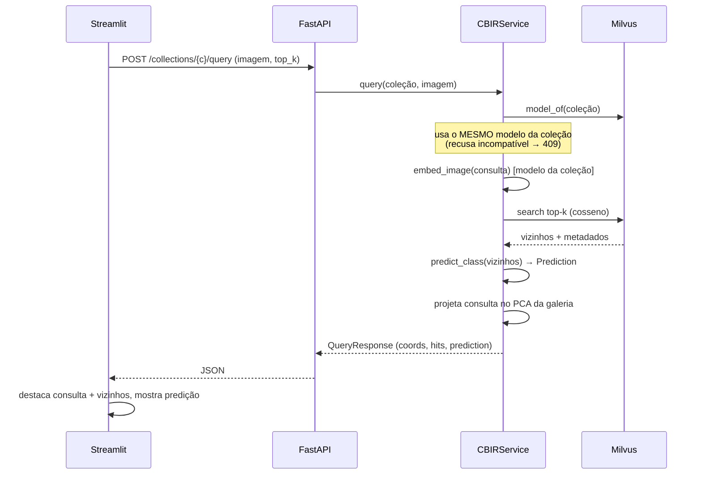
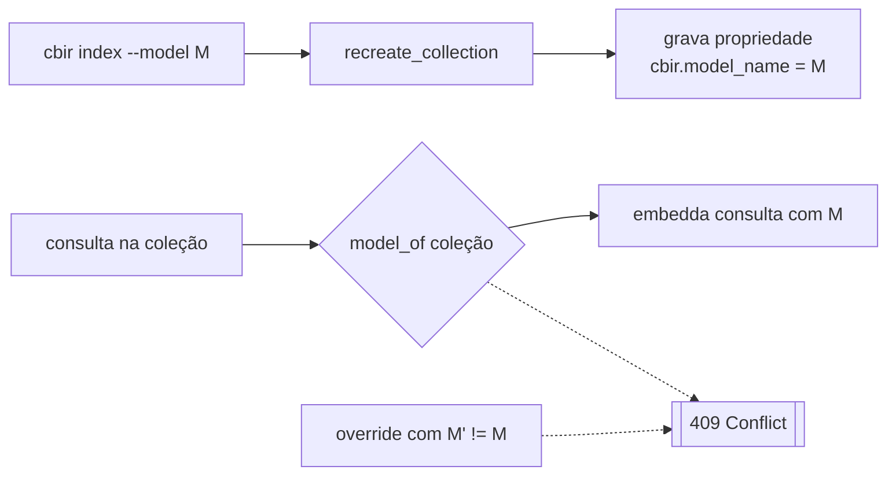
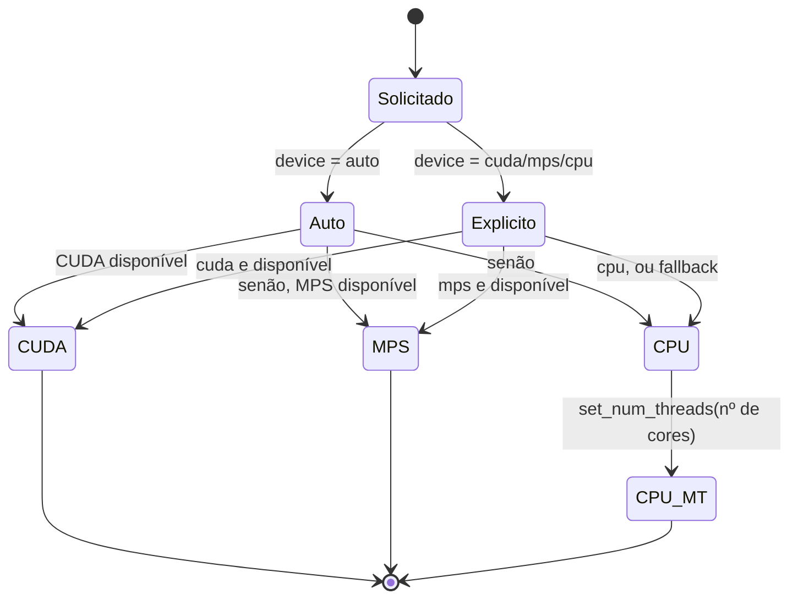
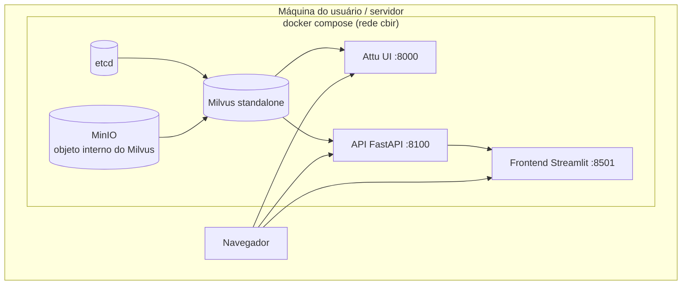

# CBIR — Explorador de Espaço Vetorial para Imagens de Embarcações

**Projeto Final de Programação — INF2102 — PUC-Rio**
**Aluno:** Gabriel Ribeiro
**Orientador:** _[preencher]_
**Palavras-chave:** Content-Based Image Retrieval, embeddings de imagem, banco de dados vetorial, PCA, K-Nearest Neighbors, rotulagem automática.

---

## Breve Descrição

O **CBIR — Explorador de Espaço Vetorial** é uma ferramenta para *recuperação de
imagens por conteúdo* (Content-Based Image Retrieval) aplicada a recortes de
embarcações. O programa indexa *embeddings* de imagem em um banco de dados
vetorial e permite **explorar visualmente o espaço de representação**: projeta a
galeria indexada em 2D/3D via PCA, aceita uma imagem de consulta, e mostra onde
ela se posiciona em relação aos aglomerados (clusters) de cada classe — além de
prever, por votação K-Nearest-Neighbors sobre os vizinhos recuperados, a que
classe a imagem consultada pertenceria, com um grau de confiança.

**Principais funções que o programa oferece:**

| Função | Descrição |
| --- | --- |
| Indexação | Extrai *embeddings* de recortes de imagem com um modelo selecionável e os armazena no Milvus. |
| Projeção | Reduz os *embeddings* da galeria a 2D/3D com PCA para visualização. |
| Consulta visual | Projeta uma imagem nova no *mesmo* espaço da galeria e destaca seus vizinhos mais próximos. |
| Predição de classe | Vota, por KNN, a classe da imagem consultada e reporta a confiança. |
| Snapshot reproduzível | Exporta/reconstrói uma coleção a partir de um cache de *embeddings* (sem GPU). |

**Usuários visados:** pesquisadores e estudantes de *CBIR* / visão computacional
que precisam **conferir visualmente** se a recuperação e a classificação de suas
representações estão coerentes — em vez de confiar apenas em métricas agregadas.

**Natureza do programa:** ferramenta utilitária funcional (prova de conceito
madura), servindo de base experimental para uma dissertação de mestrado sobre
rotulagem automática por recuperação.

**Ressalva de uso:** o programa **não** treina modelos e **não** é um
classificador de produção. A predição KNN é uma *heurística de rotulagem por
recuperação*, cuja confiabilidade é justamente o objeto de estudo. Os
*embeddings* vêm de um modelo genérico externo (OpenCLIP), não de um modelo
especializado no domínio.

---

## Visão de Projeto

Esta seção apresenta quatro cenários (dois positivos e dois negativos) que
orientam a intenção do criador e a interpretação do usuário.

### Cenário Positivo 1 — Conferir um agrupamento coerente

Marina, pesquisadora de CBIR, quer saber se um *embedding* genérico separa bem
recortes de `Traineira` de `Rebocador`. Ela indexa a galeria de amostra, abre o
explorador, escolhe a projeção 3D e vê quatro nuvens de cor razoavelmente
distintas. Ela arrasta um recorte de `Rebocador` como consulta: o ponto vermelho
cai **dentro** da nuvem de `Rebocador`, os 10 vizinhos exibidos são todos
rebocadores, e o painel de predição mostra **"seria rotulada como Rebocador —
90% de confiança"**. Marina conclui, visualmente, que a representação é adequada
para essa classe naquela faixa de tamanho.

> Este cenário evoca as funções centrais: indexação, projeção, consulta e
> predição. Note que Marina não precisou de nenhuma métrica agregada — a
> resposta veio da posição do ponto e da concordância dos vizinhos.

### Cenário Positivo 2 — Trocar de modelo com garantia de consistência

Pedro desconfia que patches menores capturariam melhor embarcações pequenas.
Ele reindexa a mesma galeria com `openclip-vit-b-16` em uma coleção separada.
Ao abrir o explorador e selecionar essa coleção, a interface exibe **"modelo de
embedding: openclip-vit-b-16"** e garante que qualquer consulta será *embeddada*
com esse mesmo modelo. Pedro compara as duas projeções lado a lado e decide qual
modelo separa melhor as classes — sem risco de comparar vetores de espaços
diferentes.

> Este cenário evoca a troca de modelos e a **garantia de consistência**: a
> coleção "lembra" com qual modelo foi construída, e o sistema recusa misturar
> espaços de *embedding*.

### Cenário Negativo 1 — Consulta com modelo incompatível

Ana tenta, via API, consultar uma coleção construída com `openclip-vit-b-32`
forçando o modelo `openclip-vit-b-16`. O sistema **recusa** a operação com um
erro `409 Conflict` e a mensagem: *"a coleção foi construída com
openclip-vit-b-32, mas a consulta pediu openclip-vit-b-16; os embeddings seriam
incomparáveis"*.

> Este cenário ilustra uma limitação **conhecida e desejada**: distâncias entre
> vetores de modelos diferentes não têm significado. O programa prefere falhar
> de forma clara a devolver um resultado silenciosamente incorreto. Não há como
> contornar isso pela interface, e é intencional.

### Cenário Negativo 2 — Recorte ambíguo mal classificado

João consulta com um recorte de `Traineira` pequeno e distante, capturado ao
fundo de uma cena. O ponto de consulta cai na fronteira entre `Traineira` e
`Navio de Carga Geral`, e a predição KNN retorna **"Navio de Carga Geral"** com
alta confiança — um erro. Ao inspecionar os vizinhos exibidos, João percebe que
todos são embarcações pequenas e distantes da mesma câmera: visualmente
parecidas, apenas alguns pixels.

> Este cenário expõe uma limitação diferente da anterior: para objetos muito
> pequenos, o *embedding* genérico captura mais o contexto de cena do que o
> objeto. O programa não esconde isso — ao contrário, a ferramenta **serve
> exatamente para tornar esse tipo de falha visível**, o que é um resultado de
> pesquisa, não um defeito de software.

---

## Documentação Técnica do Projeto

### Modelo de Arquitetura

O sistema é organizado em três camadas com dependência unidirecional
(*frontend* → API → *backend*), mais os contratos de dados e a observabilidade
compartilhados.



### Modelo de Dados

A unidade canônica é o **recorte de *bounding box***. Um *manifest* (JSONL, um
registro por caixa) descreve cada item; o recorte é derivado em tempo de
execução. Os *embeddings* e metadados são persistidos no Milvus.



O diagrama entidade-relação abaixo detalha as entidades persistidas e suas
cardinalidades. Uma imagem-fonte contém muitas caixas; cada caixa vira um item
indexado; cada consulta produz muitos vizinhos, que alimentam uma predição.



O esquema de metadados carregado com cada vetor foi escolhido para ser
exatamente o que o *frontend* precisa:

| Campo | Uso |
| --- | --- |
| `target_class` | Cor do ponto no gráfico e voto KNN |
| `split`, `camera_id`, `size_bucket` | Facetas / *hover* |
| `image_path` | Servir o recorte como miniatura |
| `bbox_x..h` | Reconstruir o recorte quando necessário |
| `embedding` | Vetor para busca por cosseno |
| _propriedade_ `cbir.model_name` | **Garantia de consistência de modelo** |

### Fluxo de Indexação



### Fluxo de Consulta (o coração da ferramenta)



### Por que PCA (e não t-SNE/UMAP) para a projeção

| Critério | PCA | t-SNE / UMAP |
| --- | --- | --- |
| Projetar consulta **nova** no mesmo espaço | Exato e barato (`transform`) | Não há `transform` exato para pontos não vistos |
| Determinismo | Sim | Estocástico |
| Preserva distâncias globais | Sim (linear) | Foca em estrutura local |
| Adequado a "onde minha consulta cai vs. clusters" | **Ideal** | Enganoso para posicionamento absoluto |

A escolha de PCA é o que torna correta a pergunta central do programa: *onde
esta imagem nova cai em relação aos clusters existentes?* — algo que exige
aplicar exatamente a mesma transformação linear à consulta e à galeria.

### A garantia de consistência de modelo



Vetores de modelos diferentes vivem em espaços distintos; comparar suas
distâncias não tem significado. O sistema grava o modelo na coleção e **sempre**
*embedda* a consulta com ele, recusando qualquer tentativa de misturar espaços.

### Resolução de *device* (auto → CUDA → MPS → CPU)

O sistema escolhe o melhor acelerador disponível e degrada com elegância,
garantindo que o *mesmo* comando rode em qualquer máquina.



### Diagrama de implantação (Docker Compose)



O perfil padrão sobe apenas o *stack* do Milvus (`docker compose up -d`); o
perfil `app` adiciona API e *frontend* (`docker compose --profile app up -d`).

### Sobre o código

| Aspecto | Decisão |
| --- | --- |
| Linguagem | Python 3.13, gerenciada por `uv` |
| Contratos de dados | Pydantic v2 (validação nas fronteiras entre camadas) |
| Extração | OpenCLIP; recorte em runtime; L2-normalização |
| Banco vetorial | Milvus *standalone* (índice FLAT, métrica cosseno) |
| Projeção | scikit-learn PCA (2D/3D), com degradação graciosa |
| API | FastAPI (endpoints finos sobre o serviço) |
| Frontend | Streamlit + Plotly (fala apenas com a API) |
| *Device* | `auto`: CUDA → Apple MPS → CPU multi-thread |
| Observabilidade | `logging` stdlib com *wide events* (um evento por operação) |
| Qualidade | `ruff` (lint), `mypy` (tipos), `pytest` (testes) |

**Estratégia de comentários:** *docstrings* explicam a *intenção* e o *porquê*
de cada módulo/função; comentários em linha marcam decisões não óbvias (ex.:
por que negar similaridade negativa no voto, por que PCA e não UMAP). Código
óbvio não é comentado.

**Estratégia de testes:** o *backend* é puro e testado sem Milvus/torch
(projeção, KNN, *manifest*, modelos); a API é testada com um serviço falso,
verificando inclusive a garantia de consistência de modelo (409). Comandos:

```bash
uv run ruff check cbir/ tests/
uv run mypy cbir/
uv run pytest
```

---

## Manual de Utilização

O manual cobre os dois tipos de usuário visados: quem quer **rodar a demo**
rapidamente e quem quer **indexar dados próprios**.

### Instalação

```text
Guia de Instruções:
%%%%%%%%%%%%%%%%%%%%
Passo 1: uv sync                 # instala dependências
Passo 2: docker compose up -d    # sobe Milvus (etcd + minio + milvus + Attu)
Passo 3: aguarde o Milvus ficar "healthy" (docker compose ps)
```

### Tarefa A — Rodar a demonstração (sem GPU, sem baixar modelo)

```text
Guia de Instruções:
%%%%%%%%%%%%%%%%%%%%
Passo 1: uv run cbir seed --collection cbir_sample \
             --parquet cbir/sample_data/embeddings.parquet
Passo 2: uv run cbir api        # terminal 1 — API em :8100
Passo 3: uv run cbir app        # terminal 2 — frontend em :8501
Passo 4: abra http://localhost:8501, escolha a coleção "cbir_sample"
Passo 5: envie um recorte de cbir/sample_data/crops/ como consulta

  >>> Alternativa (Docker, stack completa):
      docker compose --profile app up -d --build
      docker compose exec api cbir seed --collection cbir_sample

Exceções ou potenciais problemas:
%%%%%%%%%%%%%%%%%%%%%%%%%%%%%%%%%%
Se [a API responde "API not reachable"]
    {
    Então faça: confirme que `cbir api` está rodando e que a porta 8100 está livre
    }
Se [o gráfico aparece vazio]
    {
    Então faça: rode `cbir seed` antes de abrir o app; a coleção precisa existir
    }
```

### Tarefa B — Indexar dados próprios

```text
Guia de Instruções:
%%%%%%%%%%%%%%%%%%%%
Passo 1: gere/possua um manifest.jsonl (um registro por bbox)
Passo 2: uv run cbir index --manifest <caminho> --collection <nome> \
             --model openclip-vit-b-32 --device auto
Passo 3: (opcional) uv run cbir export --collection <nome> \
             --model openclip-vit-b-32   # snapshot reproduzível
Passo 4: abra o frontend e selecione a nova coleção

  >>> Para trocar de modelo, use --model openclip-vit-b-16 e um nome de
  >>> coleção diferente. A coleção guarda o modelo; a consulta usará o mesmo.

Exceções ou potenciais problemas:
%%%%%%%%%%%%%%%%%%%%%%%%%%%%%%%%%%
Se [Condição: "No records selected"]
    {
    Então faça: revise --split / --benchmark-only / --per-class
    }
Se [Condição: consulta recusada com 409]
    É porque: a coleção foi construída com outro modelo; use o modelo da coleção
```

### Referência de comandos

| Comando | O que faz |
| --- | --- |
| `cbir sample` | Constrói o dataset de amostra comitável (recortes + manifest) |
| `cbir index` | Extrai *embeddings* de um manifest e indexa no Milvus |
| `cbir export` | Exporta os *embeddings* de uma coleção para um cache Parquet |
| `cbir seed` | Reconstrói uma coleção a partir de um cache Parquet (sem modelo) |
| `cbir api` | Sobe o serviço FastAPI |
| `cbir app` | Sobe o *frontend* Streamlit |

### Endpoints da API

| Método | Rota | Função |
| --- | --- | --- |
| GET | `/health` | Verificação de vida |
| GET | `/models` | Modelos de *embedding* disponíveis |
| GET | `/collections` | Coleções indexadas + modelo + contagem |
| GET | `/collections/{n}/project?n_components=2\|3` | Coordenadas PCA da galeria |
| POST | `/collections/{n}/query` | Imagem → vizinhos + predição KNN + coords |
| GET | `/crop?image_path=...` | Serve um recorte por caminho de manifest |

---

## Verificação

O sistema foi validado de ponta a ponta na máquina de desenvolvimento
(Apple Silicon, *device* `mps`):

| Verificação | Resultado |
| --- | --- |
| Indexação da amostra (160 recortes, 4 classes) | 160 itens em ~29 s (MPS) |
| Projeção PCA 2D/3D da galeria | 160 pontos, `transform` da consulta exato |
| Consulta ponta a ponta (upload → busca → KNN → projeção) | Predição coerente com confiança |
| Garantia de consistência de modelo | Recusa (409) confirmada em teste |
| `ruff` / `mypy` / `pytest` | Limpo / limpo / 30 testes passando |
| Reconstrução via cache (`seed`) | Coleção recriada em ~3 s sem modelo/GPU |

_Data: _[preencher]_ — repositório: `cbir/`._
