# Explorador de Espaço Vetorial para Imagens

**Projeto Final de Programação (INF2102), PUC-Rio**
**Aluno:** Gabriel Ribeiro Gomes (ggomes@inf.puc-rio.br)
**Orientador:** Alberto Barbosa Raposo (abraposo@inf.puc-rio.br)
**Palavras-chave:** recuperação de imagens por conteúdo, embeddings de imagem, banco de dados vetorial, PCA, K-Nearest Neighbors, rotulagem automática.

> **Estudo de caso e dados de exemplo:** o sistema é genérico e funciona com
> qualquer imagem. O conjunto de amostra usado nas demonstrações vem de um
> projeto de monitoramento de embarcações na Baía de Guanabara (TecGraf
> PUC-Rio / Embraer), mas nada no sistema é específico desse domínio.

---

## O que é Recuperação de Imagens por Conteúdo (CBIR)

Recuperação de imagens por conteúdo (do inglês *Content-Based Image Retrieval*,
CBIR) é a tarefa de buscar imagens semelhantes a uma imagem de consulta usando o
*próprio conteúdo visual*, e não texto, etiquetas ou metadados associados [1]. A
ideia central: converter cada imagem em um vetor numérico (um *embedding*) que
captura suas características visuais, de modo que imagens parecidas fiquem
próximas em um espaço vetorial e imagens diferentes fiquem distantes. A busca
por semelhança vira, então, uma busca por vizinhos mais próximos nesse espaço.

Isso é importante por várias razões práticas e de pesquisa:

- **Busca sem rótulos:** permite encontrar imagens relevantes mesmo quando não
  há descrição textual, o que é comum em grandes acervos não anotados.
- **Rotulagem automática:** se uma imagem nova cai perto de um aglomerado de
  imagens de classe conhecida, pode-se propor um rótulo para ela. Esse é o
  princípio que motiva este trabalho e a dissertação associada.
- **Avaliação de representações:** a qualidade de um *embedding* pode ser
  julgada por quão bem ele agrupa imagens da mesma classe e separa classes
  diferentes.

O desafio central da área é obter representações (embeddings) que capturem
semelhança *semântica*, e não apenas semelhança de pixels: duas fotos do mesmo
objeto sob ângulos ou iluminações diferentes devem ficar próximas. Modelos
modernos de visão (como CLIP) [2] produzem embeddings genéricos fortes, e uma parte
importante da pesquisa em CBIR é justamente medir o quão confiáveis esses
embeddings são para uma tarefa concreta. Este programa serve exatamente a esse
propósito: tornar visível e mensurável o comportamento de recuperação.

---

## Breve Descrição

O **Explorador de Espaço Vetorial para Imagens** é uma ferramenta de recuperação
de imagens por conteúdo. O programa indexa *embeddings* de imagem em um banco de
dados vetorial e permite **explorar visualmente o espaço de representação**:
projeta a galeria indexada em 2D/3D via PCA, aceita uma imagem de consulta, e
mostra onde ela se posiciona em relação aos aglomerados (clusters) de cada
classe. Além disso, prevê por votação K-Nearest-Neighbors (KNN) [3] sobre os
vizinhos recuperados a que classe a imagem consultada pertenceria, com um grau
de confiança.

**Principais funções que o programa oferece:**

| Função | Descrição |
| --- | --- |
| Indexação | Extrai *embeddings* de recortes de imagem com um modelo selecionável e os armazena no Milvus. |
| Projeção | Reduz os *embeddings* da galeria a 2D/3D com PCA para visualização. |
| Consulta visual | Projeta uma imagem nova no *mesmo* espaço da galeria e destaca seus vizinhos mais próximos. |
| Predição de classe | Vota, por KNN, a classe da imagem consultada e reporta a confiança. |
| Snapshot reproduzível | Exporta/reconstrói uma coleção a partir de um cache de *embeddings* (sem GPU). |

**Usuários visados:** pesquisadores e estudantes de *CBIR* / visão computacional
que precisam **conferir visualmente** se a recuperação e a classificação de suas
representações estão coerentes, em vez de confiar apenas em métricas agregadas.

**Natureza do programa:** ferramenta utilitária funcional (prova de conceito
madura), servindo de base experimental para uma dissertação de mestrado sobre
rotulagem automática por recuperação.

**Ressalva de uso:** o programa **não** treina modelos e **não** é um
classificador de produção. A predição KNN é uma *heurística de rotulagem por
recuperação*, cuja confiabilidade é justamente o objeto de estudo. Os
*embeddings* vêm de um modelo genérico externo (OpenCLIP), não de um modelo
especializado no domínio.

---

## Visão de Projeto

Esta seção apresenta quatro cenários (dois positivos e dois negativos) que
orientam a intenção do criador e a interpretação do usuário.

### Cenário Positivo 1: Conferir um agrupamento coerente

Marina, pesquisadora de CBIR, quer saber se um *embedding* genérico separa bem
recortes de `Traineira` de `Rebocador`. Ela indexa a galeria de amostra, abre o
explorador, escolhe a projeção 3D e vê quatro nuvens de cor razoavelmente
distintas. Ela arrasta um recorte de `Rebocador` como consulta: o ponto vermelho
cai **dentro** da nuvem de `Rebocador`, os 10 vizinhos exibidos são todos
rebocadores, e o painel de predição mostra **"seria rotulada como Rebocador,
90% de confiança"**. Marina conclui, visualmente, que a representação é adequada
para essa classe naquela faixa de tamanho.

> Este cenário evoca as funções centrais: indexação, projeção, consulta e
> predição. Note que Marina não precisou de nenhuma métrica agregada: a
> resposta veio da posição do ponto e da concordância dos vizinhos.

### Cenário Positivo 2: Trocar de modelo com garantia de consistência

Pedro desconfia que patches menores capturariam melhor embarcações pequenas.
Ele reindexa a mesma galeria com `openclip-vit-b-16` em uma coleção separada.
Ao abrir o explorador e selecionar essa coleção, a interface exibe **"modelo de
embedding: openclip-vit-b-16"** e garante que qualquer consulta será *embeddada*
com esse mesmo modelo. Pedro compara as duas projeções lado a lado e decide qual
modelo separa melhor as classes, sem risco de comparar vetores de espaços
diferentes.

> Este cenário evoca a troca de modelos e a **garantia de consistência**: a
> coleção "lembra" com qual modelo foi construída, e o sistema recusa misturar
> espaços de *embedding*.

### Cenário Negativo 1: Consulta com modelo incompatível

Ana tenta, via API, consultar uma coleção construída com `openclip-vit-b-32`
forçando o modelo `openclip-vit-b-16`. O sistema **recusa** a operação com um
erro `409 Conflict` e a mensagem: *"a coleção foi construída com
openclip-vit-b-32, mas a consulta pediu openclip-vit-b-16; os embeddings seriam
incomparáveis"*.

> Este cenário ilustra uma limitação **conhecida e desejada**: distâncias entre
> vetores de modelos diferentes não têm significado. O programa prefere falhar
> de forma clara a devolver um resultado silenciosamente incorreto. Não há como
> contornar isso pela interface, e é intencional.

### Cenário Negativo 2: Recorte ambíguo mal classificado

João consulta com um recorte de `Traineira` pequeno e distante, capturado ao
fundo de uma cena. O ponto de consulta cai na fronteira entre `Traineira` e
`Navio de Carga Geral`, e a predição KNN retorna **"Navio de Carga Geral"** com
alta confiança (um erro). Ao inspecionar os vizinhos exibidos, João percebe que
todos são embarcações pequenas e distantes da mesma câmera: visualmente
parecidas, apenas alguns pixels.

> Este cenário expõe uma limitação diferente da anterior: para objetos muito
> pequenos, o *embedding* genérico captura mais o contexto de cena do que o
> objeto. O programa não esconde isso: ao contrário, a ferramenta **serve
> exatamente para tornar esse tipo de falha visível**, o que é um resultado de
> pesquisa, não um defeito de software.

---

## Documentação Técnica do Projeto

### Modelo de Arquitetura

O sistema é organizado em três camadas com dependência unidirecional
(*frontend* → API → *backend*), mais os contratos de dados e a observabilidade
compartilhados.


### Modelo de Dados

A unidade canônica é o **recorte de *bounding box***. Um *manifest* (JSONL, um
registro por caixa) descreve cada item; o recorte é derivado em tempo de
execução. Os *embeddings* e metadados são persistidos no Milvus.

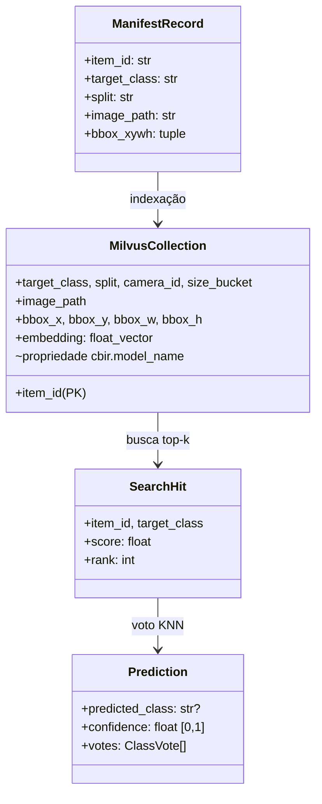

O diagrama entidade-relação abaixo detalha as entidades persistidas e suas
cardinalidades. Uma imagem-fonte contém muitas caixas; cada caixa vira um item
indexado; cada consulta produz muitos vizinhos, que alimentam uma predição.

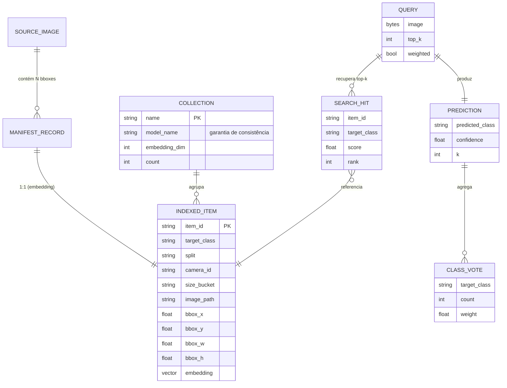

O esquema de metadados carregado com cada vetor foi escolhido para ser
exatamente o que o *frontend* precisa:

| Campo | Uso |
| --- | --- |
| `target_class` | Cor do ponto no gráfico e voto KNN |
| `split`, `camera_id`, `size_bucket` | Facetas / *hover* |
| `image_path` | Servir o recorte como miniatura |
| `bbox_x..h` | Reconstruir o recorte quando necessário |
| `embedding` | Vetor para busca por cosseno |
| _propriedade_ `cbir.model_name` | **Garantia de consistência de modelo** |

### Fluxo de Indexação

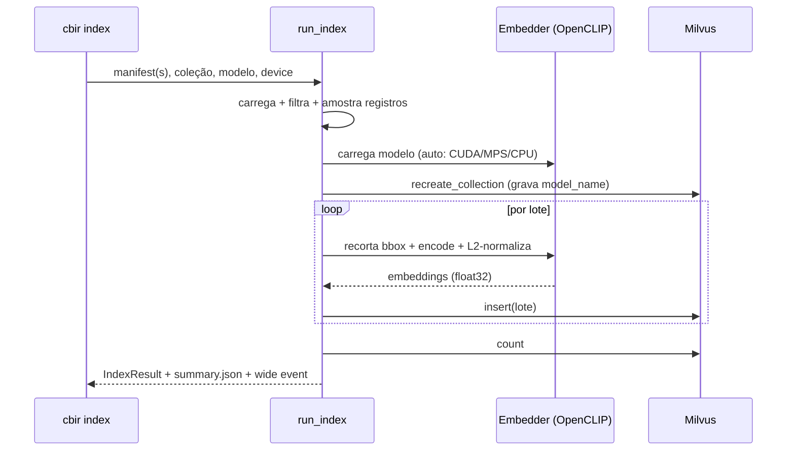

### Fluxo de Consulta (o coração da ferramenta)

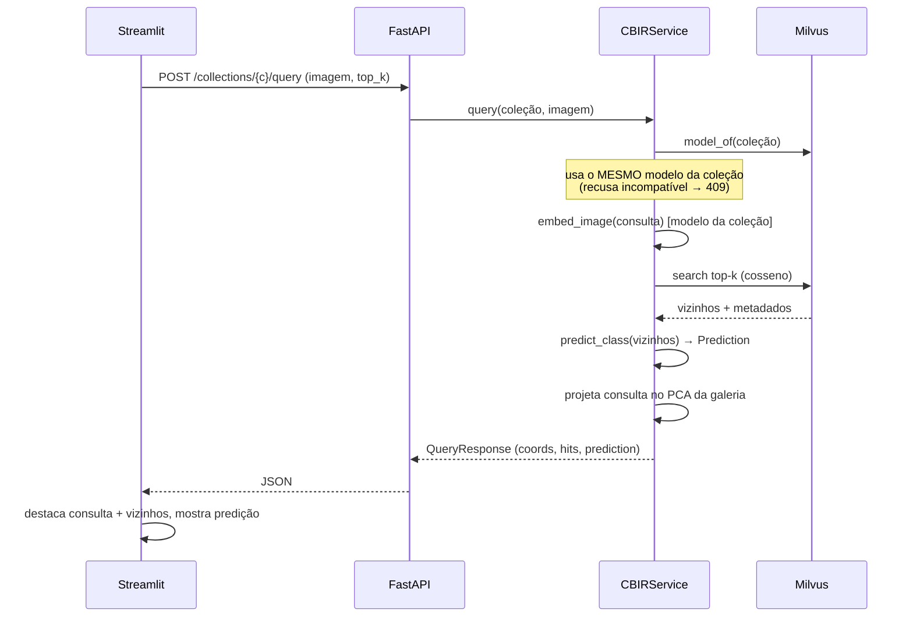

### Fundamentos: PCA e redução de dimensionalidade

Cada *embedding* produzido pelo modelo é um vetor de alta dimensão (no caso do
OpenCLIP ViT-B/32, 512 dimensões). Esse espaço é o que permite medir semelhança
com precisão, mas é **impossível de visualizar diretamente**: não há como
desenhar um ponto em 512 eixos. Para inspecionar o espaço a olho nu precisamos
projetá-lo em 2 ou 3 dimensões, aceitando que *parte da informação será perdida*
nessa compressão. É um compromisso consciente: trocamos fidelidade por
interpretabilidade visual.

A Análise de Componentes Principais (PCA) [4] faz essa redução buscando as
direções de *maior variância* dos dados. Dada uma matriz `X` (n embeddings
centrados, com média zero), a PCA calcula a matriz de covariância
`C = (1/n) Xᵀ X` e resolve seu problema de autovalores `C·vᵢ = λᵢ·vᵢ`. Os
autovetores `vᵢ` (componentes principais) são ortogonais e ordenados pelos
autovalores `λᵢ`, que medem quanta variância cada direção captura. Para
visualizar em `k` dimensões (`k = 2` ou `3`), tomamos os `k` autovetores de
maior autovalor, formando `Wₖ`, e projetamos `Z = X·Wₖ`. A fração de variância
preservada é `(λ₁ + ... + λₖ) / (λ₁ + ... + λ_d)`; o relatório da interface
mostra esse valor para deixar explícito o quanto foi perdido. Por ser uma
transformação *linear*, a PCA projeta uma imagem de consulta nova no mesmo
espaço com a mesma multiplicação `z = x·Wₖ`, o que é a propriedade essencial
para posicionar a consulta em relação aos aglomerados existentes. A ideia
geométrica em duas dimensões: a primeira componente principal (`v₁`) aponta na
direção de maior espalhamento dos dados, e a segunda (`v₂`), ortogonal, na
direção de maior variância restante.

### Por que PCA (e não t-SNE/UMAP) para a projeção

A projeção usa Análise de Componentes Principais (PCA) [4], uma redução linear
de dimensionalidade. A alternativa seriam métodos não lineares como o t-SNE [5]
ou o UMAP [6], mas eles não oferecem uma transformação exata para projetar um
ponto novo (a consulta) no mesmo espaço da galeria já ajustada.

| Critério | PCA | t-SNE / UMAP |
| --- | --- | --- |
| Projetar consulta **nova** no mesmo espaço | Exato e barato (`transform`) | Não há `transform` exato para pontos não vistos |
| Determinismo | Sim | Estocástico |
| Preserva distâncias globais | Sim (linear) | Foca em estrutura local |
| Adequado a "onde minha consulta cai vs. clusters" | **Ideal** | Enganoso para posicionamento absoluto |

A escolha de PCA é o que torna correta a pergunta central do programa: *onde
esta imagem nova cai em relação aos clusters existentes?*, algo que exige
aplicar exatamente a mesma transformação linear à consulta e à galeria.

### A garantia de consistência de modelo

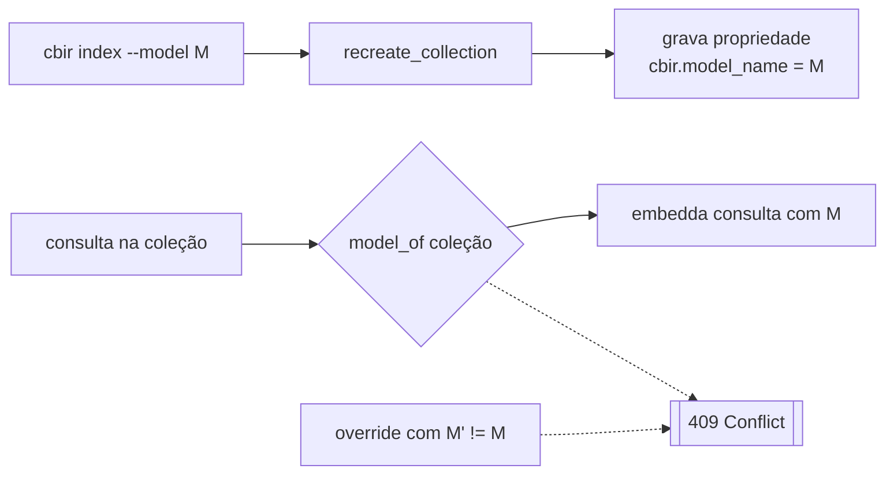

Vetores de modelos diferentes vivem em espaços distintos; comparar suas
distâncias não tem significado. O sistema grava o modelo na coleção e **sempre**
*embedda* a consulta com ele, recusando qualquer tentativa de misturar espaços.

### Resolução de *device* (auto → CUDA → MPS → CPU)

O sistema escolhe o melhor acelerador disponível e degrada com elegância,
garantindo que o *mesmo* comando rode em qualquer máquina.

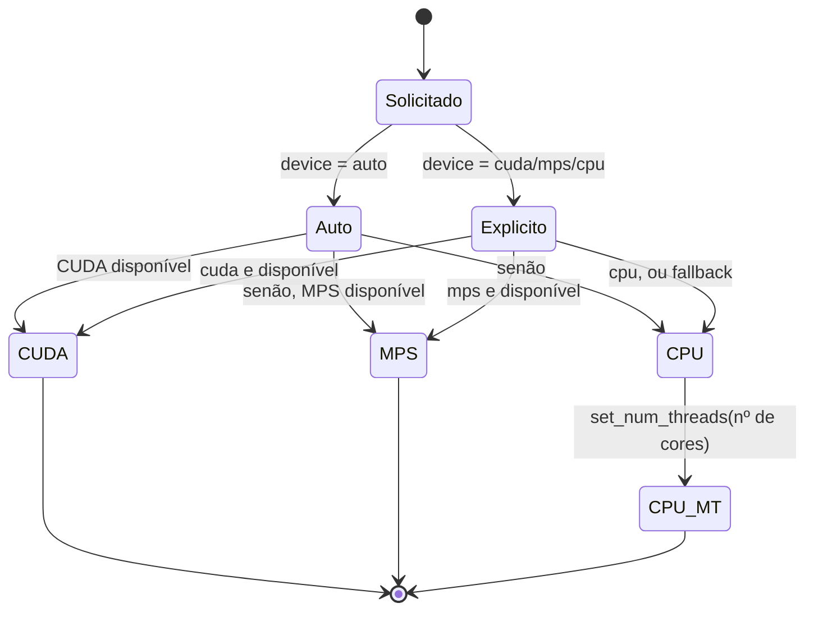

### Diagrama de implantação (Docker Compose)

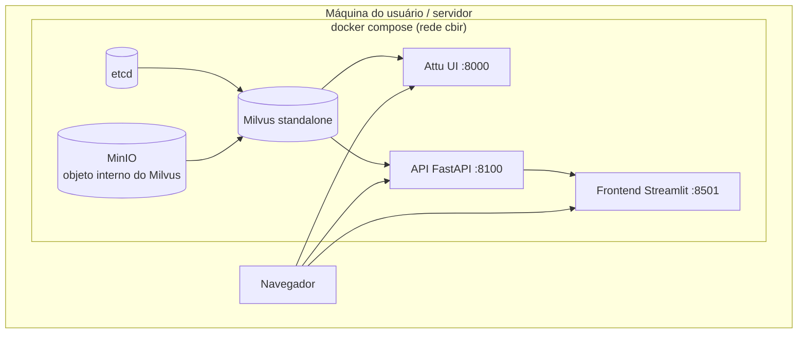

O perfil padrão sobe apenas o *stack* do Milvus (`docker compose up -d`); o
perfil `app` adiciona API e *frontend* (`docker compose --profile app up -d`).

### Sobre o código

As principais tecnologias empregadas, com uma breve explicação de cada uma:

- **Python 3.13** com **uv**: linguagem do projeto e gerenciador de
  dependências/ambientes (rápido, com *lockfile* reproduzível).
- **OpenCLIP** [7]: implementação aberta do modelo CLIP, que converte uma imagem em
  um vetor (*embedding*) que captura seu conteúdo visual.
- **Milvus** [8]: banco de dados vetorial, especializado em armazenar *embeddings* e
  fazer busca por vizinhos mais próximos em larga escala.
- **scikit-learn (PCA)** [9]: biblioteca de *machine learning*; usamos o PCA para
  reduzir os vetores a 2D/3D preservando as direções de maior variância.
- **FastAPI**: *framework* web para APIs em Python, com validação e documentação
  automáticas; expõe o *backend* via HTTP.
- **Streamlit** com **Plotly**: Streamlit constrói a interface web em Python
  puro; Plotly desenha os gráficos de dispersão 2D/3D interativos.
- **Pydantic v2**: valida e tipa os dados que trafegam entre as camadas,
  garantindo que todas concordem sobre o formato.
- **ruff**, **mypy**, **pytest**: *linter*/formatador, verificador de tipos
  estático e *framework* de testes, respectivamente.
- **Docker Compose**: orquestra os serviços (Milvus, API, interface) em
  contêineres, para subir tudo com um comando.

A tabela abaixo resume as decisões de implementação:

| Aspecto | Decisão |
| --- | --- |
| Linguagem | Python 3.13, gerenciada por `uv` |
| Contratos de dados | Pydantic v2 (validação nas fronteiras entre camadas) |
| Extração | OpenCLIP; recorte em runtime; L2-normalização |
| Banco vetorial | Milvus *standalone* (índice FLAT, métrica cosseno) |
| Projeção | scikit-learn PCA (2D/3D), com degradação graciosa |
| API | FastAPI (endpoints finos sobre o serviço) |
| Frontend | Streamlit + Plotly (fala apenas com a API) |
| *Device* | `auto`: CUDA → Apple MPS → CPU multi-thread |
| Observabilidade | `logging` stdlib com *wide events* (um evento por operação) |
| Qualidade | `ruff` (lint), `mypy` (tipos), `pytest` (testes) |

**Estratégia de comentários:** *docstrings* explicam a *intenção* e o *porquê*
de cada módulo/função; comentários em linha marcam decisões não óbvias (ex.:
por que negar similaridade negativa no voto, por que PCA e não UMAP). Código
óbvio não é comentado.

---

## Testes

A suíte tem **30 testes** e foi desenhada para ser rápida e determinística: o
*backend* é puro e testado sem Milvus nem *torch*, e a API é testada com um
serviço falso (dublê), o que dispensa qualquer dependência externa e ainda
permite verificar a garantia de consistência de modelo (resposta `409`). Os
testes rodam em poucos segundos.

| Arquivo | O que cobre | Nº |
| --- | --- | ---: |
| `test_knn.py` | Voto KNN: conjunto vazio, unanimidade, maioria vs. voto ponderado, corte por `k`, similaridade negativa sem subtrair evidência, desempate determinístico | 7 |
| `test_manifest.py` | Contrato de dados: rejeição de `item_id` duplicado, campos obrigatórios, filtros por split/benchmark, amostragem determinística por classe, recorte de bbox com clip nas bordas | 7 |
| `test_projection.py` | PCA: dimensionalidade pedida, `transform` reproduz a galeria (base da projeção da consulta), vetor único, degradação graciosa, galeria vazia, determinismo | 6 |
| `test_api.py` | Contrato HTTP: `health`, coleções com seu modelo, projeção e 404, consulta feliz com predição, upload inválido rejeitado | 6 |
| `test_models.py` | Modelos Pydantic: limites de confiança, `rank` positivo, campos `model_*`, *round-trip* JSON | 4 |

Trecho ilustrativo (o voto ponderado por similaridade pode inverter o vencedor
em relação à maioria simples):

```python
def test_weighted_vote_can_flip_the_winner() -> None:
    hits = [
        _hit("a", "Traineira", 0.30, 1),
        _hit("b", "Traineira", 0.31, 2),
        _hit("c", "Lancha", 0.99, 3),
    ]
    pred = predict_class(hits, weighted=True)
    assert pred.predicted_class == "Lancha"
    assert abs(pred.confidence - 0.99 / 1.60) < 1e-6
```

Execução completa (as três verificações devem ficar verdes):

```bash
uv run ruff check cbir/ tests/   # lint
uv run mypy cbir/                # tipos
uv run pytest                    # 30 testes
```

---

## Manual de Utilização

O manual cobre os dois tipos de usuário visados: quem quer **rodar a demo**
rapidamente e quem quer **indexar dados próprios**.

### Instalação

```text
Guia de Instruções:
%%%%%%%%%%%%%%%%%%%%
Passo 1: uv sync                 # instala dependências
Passo 2: docker compose up -d    # sobe Milvus (etcd + minio + milvus + Attu)
Passo 3: aguarde o Milvus ficar "healthy" (docker compose ps)
```

### Tarefa A: Rodar a demonstração (sem GPU, sem baixar modelo)

```text
Guia de Instruções:
%%%%%%%%%%%%%%%%%%%%
Passo 1: uv run cbir seed --collection cbir_sample \
             --parquet cbir/sample_data/embeddings.parquet
Passo 2: uv run cbir api        # terminal 1: API em :8100
Passo 3: uv run cbir app        # terminal 2: frontend em :8501
Passo 4: abra http://localhost:8501, escolha a coleção "cbir_sample"
Passo 5: envie um recorte de cbir/sample_data/crops/ como consulta

  >>> Alternativa (Docker, stack completa):
      docker compose --profile app up -d --build
      docker compose exec api cbir seed --collection cbir_sample

Exceções ou potenciais problemas:
%%%%%%%%%%%%%%%%%%%%%%%%%%%%%%%%%%
Se [a API responde "API not reachable"]
    {
    Então faça: confirme que `cbir api` está rodando e que a porta 8100 está livre
    }
Se [o gráfico aparece vazio]
    {
    Então faça: rode `cbir seed` antes de abrir o app; a coleção precisa existir
    }
```

### Tarefa B: Indexar dados próprios

```text
Guia de Instruções:
%%%%%%%%%%%%%%%%%%%%
Passo 1: gere/possua um manifest.jsonl (um registro por bbox)
Passo 2: uv run cbir index --manifest <caminho> --collection <nome> \
             --model openclip-vit-b-32 --device auto
Passo 3: (opcional) uv run cbir export --collection <nome> \
             --model openclip-vit-b-32   # snapshot reproduzível
Passo 4: abra o frontend e selecione a nova coleção

  >>> Para trocar de modelo, use --model openclip-vit-b-16 e um nome de
  >>> coleção diferente. A coleção guarda o modelo; a consulta usará o mesmo.

Exceções ou potenciais problemas:
%%%%%%%%%%%%%%%%%%%%%%%%%%%%%%%%%%
Se [Condição: "No records selected"]
    {
    Então faça: revise --split / --benchmark-only / --per-class
    }
Se [Condição: consulta recusada com 409]
    É porque: a coleção foi construída com outro modelo; use o modelo da coleção
```

### Referência de comandos

| Comando | O que faz |
| --- | --- |
| `cbir sample` | Constrói o dataset de amostra comitável (recortes + manifest) |
| `cbir index` | Extrai *embeddings* de um manifest e indexa no Milvus |
| `cbir export` | Exporta os *embeddings* de uma coleção para um cache Parquet |
| `cbir seed` | Reconstrói uma coleção a partir de um cache Parquet (sem modelo) |
| `cbir api` | Sobe o serviço FastAPI |
| `cbir app` | Sobe o *frontend* Streamlit |

### Endpoints da API

| Método | Rota | Função |
| --- | --- | --- |
| GET | `/health` | Verificação de vida |
| GET | `/models` | Modelos de *embedding* disponíveis |
| GET | `/collections` | Coleções indexadas + modelo + contagem |
| GET | `/collections/{n}/project?n_components=2\|3` | Coordenadas PCA da galeria |
| POST | `/collections/{n}/query` | Imagem → vizinhos + predição KNN + coords |
| GET | `/crop?image_path=...` | Serve um recorte por caminho de manifest |

---

## Verificação

O sistema foi validado de ponta a ponta na máquina de desenvolvimento
(Apple Silicon, *device* `mps`):

| Verificação | Resultado |
| --- | --- |
| Indexação da amostra (160 recortes, 4 classes) | 160 itens em ~29 s (MPS) |
| Projeção PCA 2D/3D da galeria | 160 pontos, `transform` da consulta exato |
| Consulta ponta a ponta (upload → busca → KNN → projeção) | Predição coerente com confiança |
| Garantia de consistência de modelo | Recusa (409) confirmada em teste |
| `ruff` / `mypy` / `pytest` | Limpo / limpo / 30 testes passando |
| Reconstrução via cache (`seed`) | Coleção recriada em ~3 s sem modelo/GPU |

**Nota sobre escala da visualização.** A verificação usou 160 vetores. O gargalo
prático da ferramenta não é o Milvus nem o PCA, e sim a renderização no
navegador: o Plotly desenha os pontos como SVG por padrão, o que mantém a
interação (rotação 3D, *hover*, *zoom*) fluida até a ordem de alguns milhares de
pontos e começa a degradar acima disso. Escalar para dezenas de milhares
exigiria trocar para renderização WebGL (`Scattergl`, que suporta ~100 mil
pontos) ou amostrar/agregar a galeria antes de plotar. Esses são limites
esperados da abordagem de renderização, não medições deste projeto, e ficam como
trabalho futuro natural.

_Data: [preencher]. Repositório: `cbir/`._

---

## Demonstração

Esta seção mostra a interface em uso, capturada sobre a coleção de amostra (`cbir_sample`, 160 recortes de 4 classes de embarcações).

A tela inicial mostra a galeria projetada em 2D por PCA e colorida por classe, com o painel lateral de controles e a variância explicada acumulada no topo.

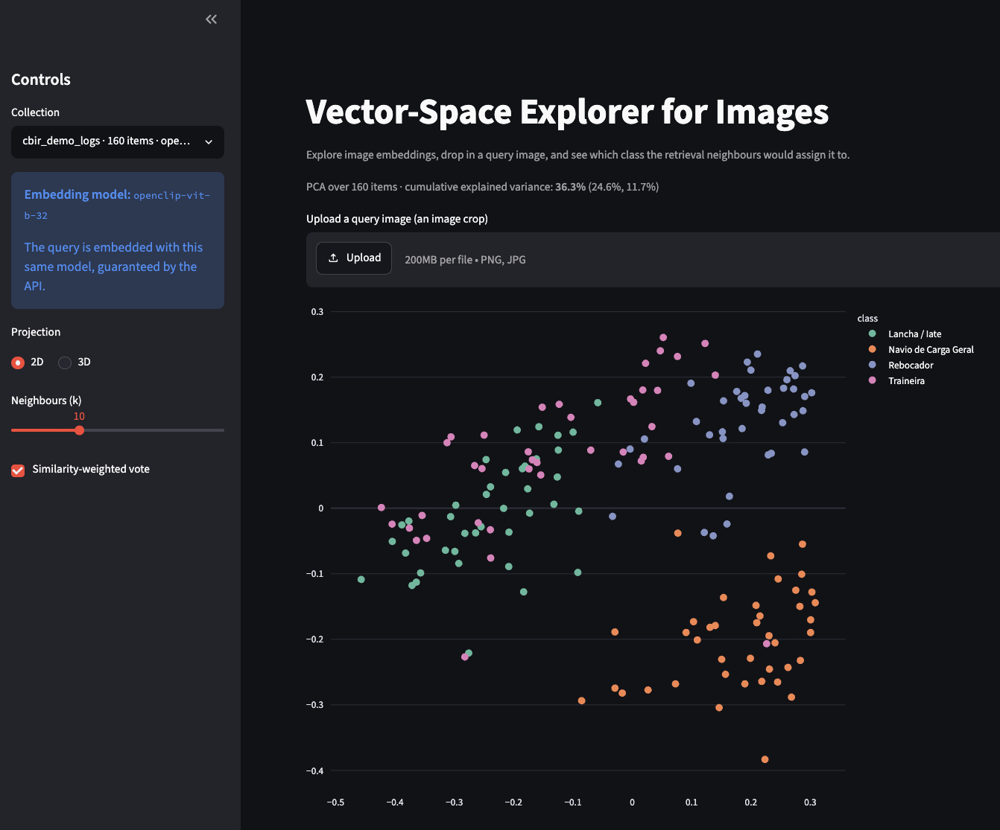

O painel de controles permite selecionar a coleção (com o modelo de embedding associado), a projeção 2D/3D, o número de vizinhos k e o voto ponderado por similaridade.

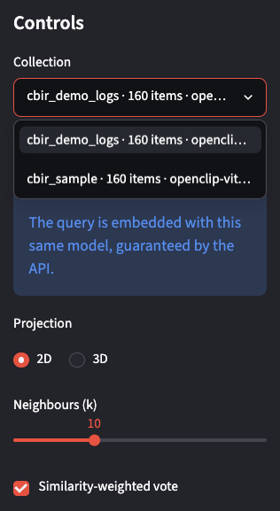

Ao enviar uma imagem de consulta, a ferramenta a projeta no mesmo espaço (losango vermelho), destaca os vizinhos recuperados (amarelo) e prevê a classe por voto KNN. Abaixo, a consulta (um recorte de Traineira) cai perto de outras traineiras, o painel de predição reporta Traineira com 70% de confiança, e a faixa inferior lista os dez vizinhos mais próximos com seus scores.

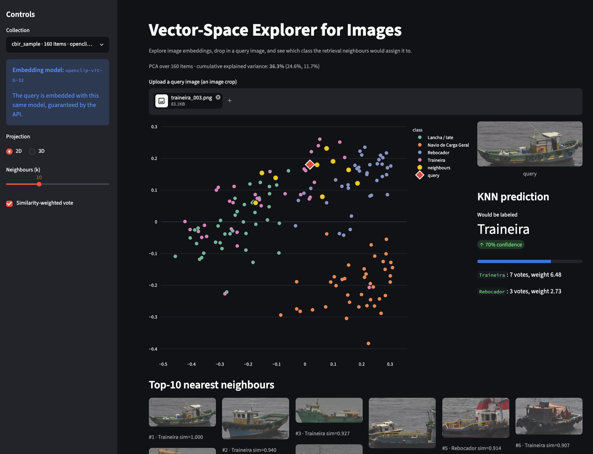

A mesma consulta na projeção 3D:

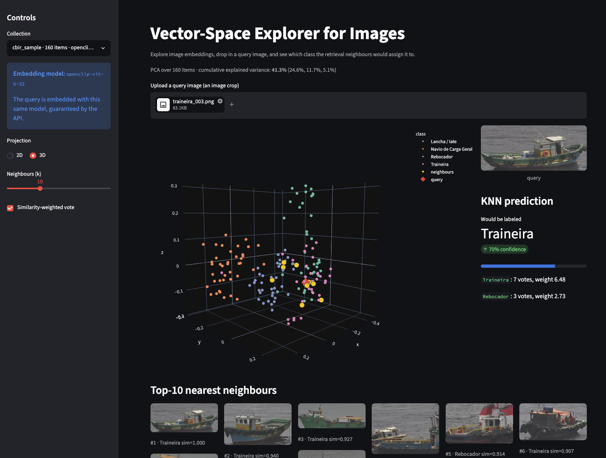

A API expõe documentação interativa gerada automaticamente pelo FastAPI, com todos os endpoints e os esquemas de dados derivados dos modelos Pydantic.

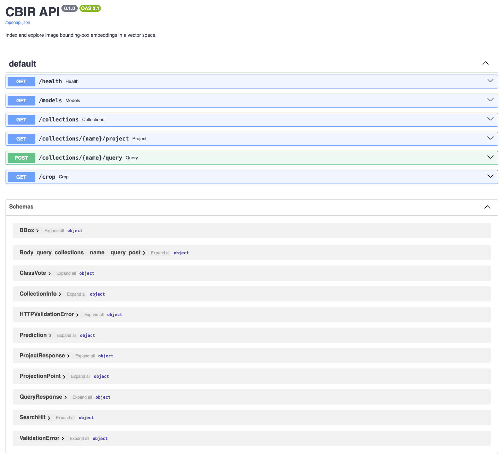

---

## Referências

1. Smeulders et al. "Content-Based Image Retrieval at the End of the Early Years." IEEE TPAMI 22(12), 2000. DOI:[10.1109/34.895972](https://doi.org/10.1109/34.895972)
2. Radford et al. "Learning Transferable Visual Models From Natural Language Supervision." ICML 2021.
3. Cover & Hart. "Nearest Neighbor Pattern Classification." IEEE Trans. Information Theory 13(1), 1967. DOI:[10.1109/TIT.1967.1053964](https://doi.org/10.1109/TIT.1967.1053964)
4. Jolliffe. "Principal Component Analysis." 2nd ed., Springer, 2002.
5. van der Maaten & Hinton. "Visualizing Data using t-SNE." JMLR 9, 2008.
6. McInnes, Healy & Melville. "UMAP: Uniform Manifold Approximation and Projection for Dimension Reduction." [arXiv:1802.03426](https://arxiv.org/abs/1802.03426), 2018.
7. Ilharco et al. "OpenCLIP." 2021. DOI:[10.5281/zenodo.5143773](https://doi.org/10.5281/zenodo.5143773). <https://github.com/mlfoundations/open_clip>
8. Wang et al. "Milvus: A Purpose-Built Vector Data Management System." SIGMOD 2021. DOI:[10.1145/3448016.3457550](https://doi.org/10.1145/3448016.3457550)
9. Pedregosa et al. "Scikit-learn: Machine Learning in Python." JMLR 12, 2011.
