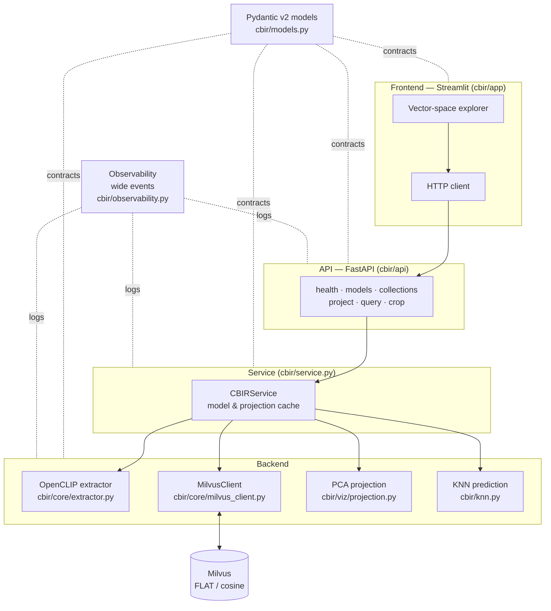
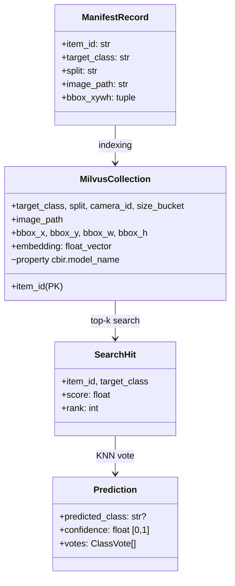
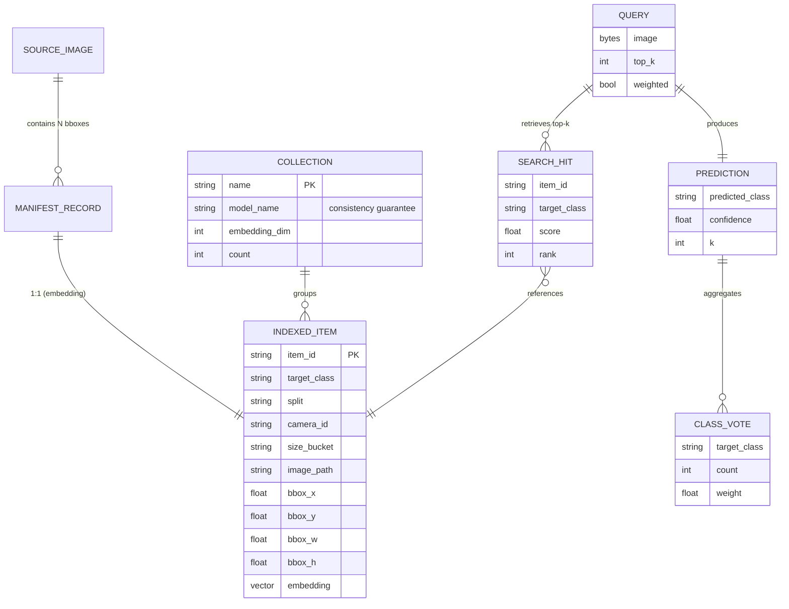
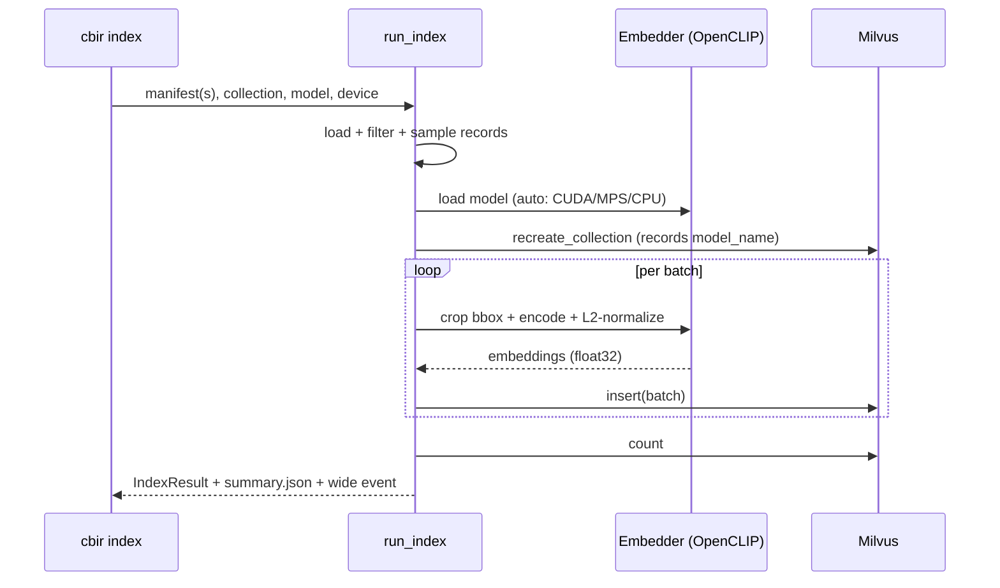
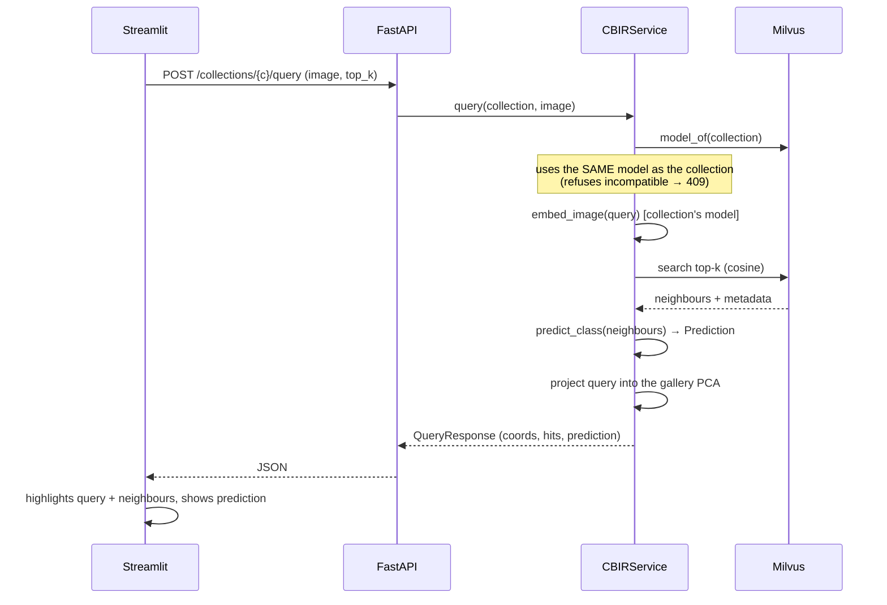
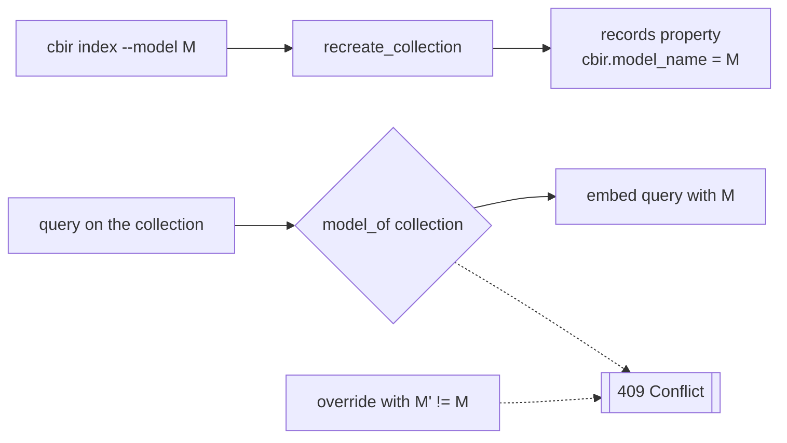
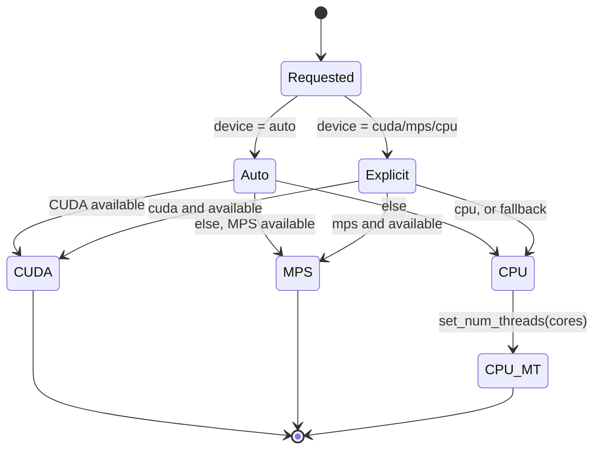
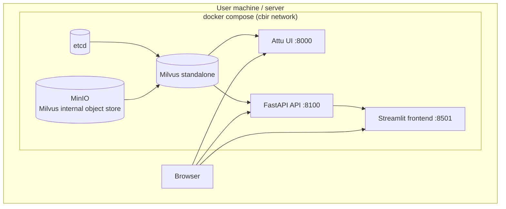

# CBIR — Vector-Space Explorer for Vessel Images

**Programming Final Project — INF2102 — PUC-Rio**
**Student:** Gabriel Ribeiro
**Advisor:** _[to fill in]_
**Keywords:** Content-Based Image Retrieval, image embeddings, vector database, PCA, K-Nearest Neighbors, automatic labeling.

---

## Brief Description

The **CBIR — Vector-Space Explorer** is a tool for *Content-Based Image
Retrieval* applied to vessel bounding-box crops. It indexes image *embeddings*
into a vector database and lets you **explore the representation space
visually**: it projects the indexed gallery to 2D/3D with PCA, accepts a query
image, and shows where it lands relative to each class cluster — plus, via a
K-Nearest-Neighbors vote over the retrieved neighbours, it predicts which class
the queried image would belong to, with a confidence score.

**Main functions the program offers:**

| Function | Description |
| --- | --- |
| Indexing | Extracts *embeddings* of image crops with a selectable model and stores them in Milvus. |
| Projection | Reduces the gallery *embeddings* to 2D/3D with PCA for visualization. |
| Visual query | Projects a new image into the *same* space as the gallery and highlights its nearest neighbours. |
| Class prediction | Votes, via KNN, the class of the queried image and reports confidence. |
| Reproducible snapshot | Exports/reconstructs a collection from an *embedding* cache (no GPU). |

**Intended users:** researchers and students of *CBIR* / computer vision who
need to **visually check** whether the retrieval and classification of their
representations are coherent — rather than relying only on aggregate metrics.

**Nature of the program:** a functional utility tool (a mature proof of
concept), serving as the experimental basis for a master's dissertation on
retrieval-based automatic labeling.

**Usage caveat:** the program does **not** train models and is **not** a
production classifier. The KNN prediction is a *retrieval-based labeling
heuristic* whose reliability is precisely the object of study. The *embeddings*
come from a generic external model (OpenCLIP), not a domain-specialized one.

---

## Project Vision

This section presents four scenarios (two positive and two negative) that guide
the creator's intent and the user's interpretation.

### Positive Scenario 1 — Confirming a coherent grouping

Marina, a CBIR researcher, wants to know whether a generic *embedding* cleanly
separates `Traineira` (fishing boat) crops from `Rebocador` (tugboat). She
indexes the sample gallery, opens the explorer, picks the 3D projection, and
sees four reasonably distinct colour clouds. She drops a `Rebocador` crop as the
query: the red point lands **inside** the `Rebocador` cloud, the 10 displayed
neighbours are all tugboats, and the prediction panel shows **"would be labeled
Rebocador — 90% confidence"**. Marina concludes, visually, that the
representation is adequate for that class in that size range.

> This scenario evokes the core functions: indexing, projection, query, and
> prediction. Note that Marina needed no aggregate metric — the answer came from
> the point's position and the neighbours' agreement.

### Positive Scenario 2 — Swapping models with a consistency guarantee

Pedro suspects that smaller patches would capture small vessels better. He
re-indexes the same gallery with `openclip-vit-b-16` into a separate collection.
On opening the explorer and selecting that collection, the interface shows
**"embedding model: openclip-vit-b-16"** and guarantees that any query will be
*embedded* with that same model. Pedro compares the two projections side by side
and decides which model separates the classes better — with no risk of
comparing vectors from different spaces.

> This scenario evokes model swapping and the **consistency guarantee**: the
> collection "remembers" which model built it, and the system refuses to mix
> *embedding* spaces.

### Negative Scenario 1 — Query with an incompatible model

Ana tries, via the API, to query a collection built with `openclip-vit-b-32`
while forcing the `openclip-vit-b-16` model. The system **refuses** the
operation with a `409 Conflict` and the message: *"the collection was built with
openclip-vit-b-32, but the query requested openclip-vit-b-16; the embeddings
would be incomparable"*.

> This scenario illustrates a **known and intended** limitation: distances
> between vectors from different models are meaningless. The program prefers to
> fail clearly rather than silently return an incorrect result. There is no way
> around it through the interface, and that is by design.

### Negative Scenario 2 — Misclassified ambiguous crop

João queries with a small, distant `Traineira` crop captured in the background
of a scene. The query point lands on the boundary between `Traineira` and
`Navio de Carga Geral` (general cargo ship), and the KNN prediction returns
**"Navio de Carga Geral"** with high confidence — a mistake. On inspecting the
displayed neighbours, João realizes they are all small, distant vessels from the
same camera: visually alike, just a few pixels.

> This scenario exposes a different limitation from the previous one: for very
> small objects, the generic *embedding* captures the scene context more than
> the object itself. The program does not hide this — on the contrary, the tool
> **exists precisely to make this kind of failure visible**, which is a research
> result, not a software defect.

---

## Technical Documentation

### Architecture Model

The system is organized into three layers with a one-directional dependency
(*frontend* → API → *backend*), plus shared data contracts and observability.



### Data Model

The canonical unit is the **bounding-box crop**. A *manifest* (JSONL, one record
per box) describes each item; the crop is derived at runtime. Embeddings and
metadata are persisted in Milvus.



The entity-relationship diagram below details the persisted entities and their
cardinalities. A source image contains many boxes; each box becomes an indexed
item; each query produces many neighbours, which feed one prediction.



The metadata schema stored with each vector was chosen to be exactly what the
*frontend* needs:

| Field | Use |
| --- | --- |
| `target_class` | Point colour in the chart and KNN vote |
| `split`, `camera_id`, `size_bucket` | Facets / hover |
| `image_path` | Serving the crop as a thumbnail |
| `bbox_x..h` | Reconstructing the crop when needed |
| `embedding` | Vector for cosine search |
| _property_ `cbir.model_name` | **Model-consistency guarantee** |

### Indexing Flow



### Query Flow (the heart of the tool)



### Why PCA (and not t-SNE/UMAP) for the projection

| Criterion | PCA | t-SNE / UMAP |
| --- | --- | --- |
| Project a **new** query into the same space | Exact and cheap (`transform`) | No exact `transform` for unseen points |
| Determinism | Yes | Stochastic |
| Preserves global distances | Yes (linear) | Focuses on local structure |
| Suited to "where does my query fall vs. clusters" | **Ideal** | Misleading for absolute placement |

The choice of PCA is what makes the program's central question well-posed:
*where does this new image fall relative to the existing clusters?* — which
requires applying exactly the same linear transform to the query and the
gallery.

### The model-consistency guarantee



Vectors from different models live in distinct spaces; comparing their distances
is meaningless. The system records the model on the collection and **always**
embeds the query with it, refusing any attempt to mix spaces.

### Device resolution (auto → CUDA → MPS → CPU)

The system picks the best available accelerator and degrades gracefully, so the
*same* command runs on any machine.



### Deployment diagram (Docker Compose)



The default profile brings up only the Milvus stack (`docker compose up -d`);
the `app` profile adds the API and frontend (`docker compose --profile app up -d`).

### About the code

| Aspect | Decision |
| --- | --- |
| Language | Python 3.13, managed with `uv` |
| Data contracts | Pydantic v2 (validation at layer boundaries) |
| Extraction | OpenCLIP; runtime crop; L2 normalization |
| Vector DB | Milvus *standalone* (FLAT index, cosine metric) |
| Projection | scikit-learn PCA (2D/3D), with graceful degradation |
| API | FastAPI (thin endpoints over the service) |
| Frontend | Streamlit + Plotly (talks only to the API) |
| *Device* | `auto`: CUDA → Apple MPS → multi-thread CPU |
| Observability | stdlib `logging` with *wide events* (one event per operation) |
| Quality | `ruff` (lint), `mypy` (types), `pytest` (tests) |

**Commenting strategy:** *docstrings* explain the *intent* and *why* of each
module/function; inline comments flag non-obvious decisions (e.g., why negative
similarity is not subtracted from a vote, why PCA rather than UMAP). Obvious code
is not commented.

**Testing strategy:** the *backend* is pure and tested without Milvus/torch
(projection, KNN, *manifest*, models); the API is tested with a fake service,
verifying even the model-consistency guarantee (409). Commands:

```bash
uv run ruff check cbir/ tests/
uv run mypy cbir/
uv run pytest
```

---

## User Manual

The manual covers the two intended user types: those who want to **run the
demo** quickly and those who want to **index their own data**.

### Installation

```text
Instruction Guide:
%%%%%%%%%%%%%%%%%%%
Step 1: uv sync                 # install dependencies
Step 2: docker compose up -d    # start Milvus (etcd + minio + milvus + Attu)
Step 3: wait until Milvus is "healthy" (docker compose ps)
```

### Task A — Run the demo (no GPU, no model download)

```text
Instruction Guide:
%%%%%%%%%%%%%%%%%%%
Step 1: uv run cbir seed --collection cbir_sample \
             --parquet cbir/sample_data/embeddings.parquet
Step 2: uv run cbir api        # terminal 1 — API on :8100
Step 3: uv run cbir app        # terminal 2 — frontend on :8501
Step 4: open http://localhost:8501, choose the "cbir_sample" collection
Step 5: upload a crop from cbir/sample_data/crops/ as the query

  >>> Alternative (Docker, full stack):
      docker compose --profile app up -d --build
      docker compose exec api cbir seed --collection cbir_sample

Exceptions or potential problems:
%%%%%%%%%%%%%%%%%%%%%%%%%%%%%%%%%%
If [the API replies "API not reachable"]
    {
    Then do: confirm `cbir api` is running and port 8100 is free
    }
If [the chart appears empty]
    {
    Then do: run `cbir seed` before opening the app; the collection must exist
    }
```

### Task B — Index your own data

```text
Instruction Guide:
%%%%%%%%%%%%%%%%%%%
Step 1: have/produce a manifest.jsonl (one record per bbox)
Step 2: uv run cbir index --manifest <path> --collection <name> \
             --model openclip-vit-b-32 --device auto
Step 3: (optional) uv run cbir export --collection <name> \
             --model openclip-vit-b-32   # reproducible snapshot
Step 4: open the frontend and select the new collection

  >>> To swap models, use --model openclip-vit-b-16 and a different collection
  >>> name. The collection stores its model; the query will use the same one.

Exceptions or potential problems:
%%%%%%%%%%%%%%%%%%%%%%%%%%%%%%%%%%
If [Condition: "No records selected"]
    {
    Then do: review --split / --benchmark-only / --per-class
    }
If [Condition: query refused with 409]
    It is because: the collection was built with another model; use the collection's model
```

### Command reference

| Command | What it does |
| --- | --- |
| `cbir sample` | Builds the committable sample dataset (crops + manifest) |
| `cbir index` | Extracts *embeddings* from a manifest and indexes into Milvus |
| `cbir export` | Exports a collection's *embeddings* to a Parquet cache |
| `cbir seed` | Reconstructs a collection from a Parquet cache (no model) |
| `cbir api` | Starts the FastAPI service |
| `cbir app` | Starts the Streamlit *frontend* |

### API endpoints

| Method | Route | Function |
| --- | --- | --- |
| GET | `/health` | Liveness check |
| GET | `/models` | Available *embedding* models |
| GET | `/collections` | Indexed collections + model + count |
| GET | `/collections/{n}/project?n_components=2\|3` | Gallery PCA coordinates |
| POST | `/collections/{n}/query` | Image → neighbours + KNN prediction + coords |
| GET | `/crop?image_path=...` | Serves a crop by manifest path |

---

## Verification

The system was validated end to end on the development machine (Apple Silicon,
`mps` device):

| Check | Result |
| --- | --- |
| Sample indexing (160 crops, 4 classes) | 160 items in ~29 s (MPS) |
| Gallery 2D/3D PCA projection | 160 points, exact query `transform` |
| End-to-end query (upload → search → KNN → projection) | Prediction consistent with confidence |
| Model-consistency guarantee | Refusal (409) confirmed in tests |
| `ruff` / `mypy` / `pytest` | Clean / clean / 30 tests passing |
| Reconstruction via cache (`seed`) | Collection recreated in ~3 s without model/GPU |

_Date: _[to fill in]_ — repository: `cbir/`._
