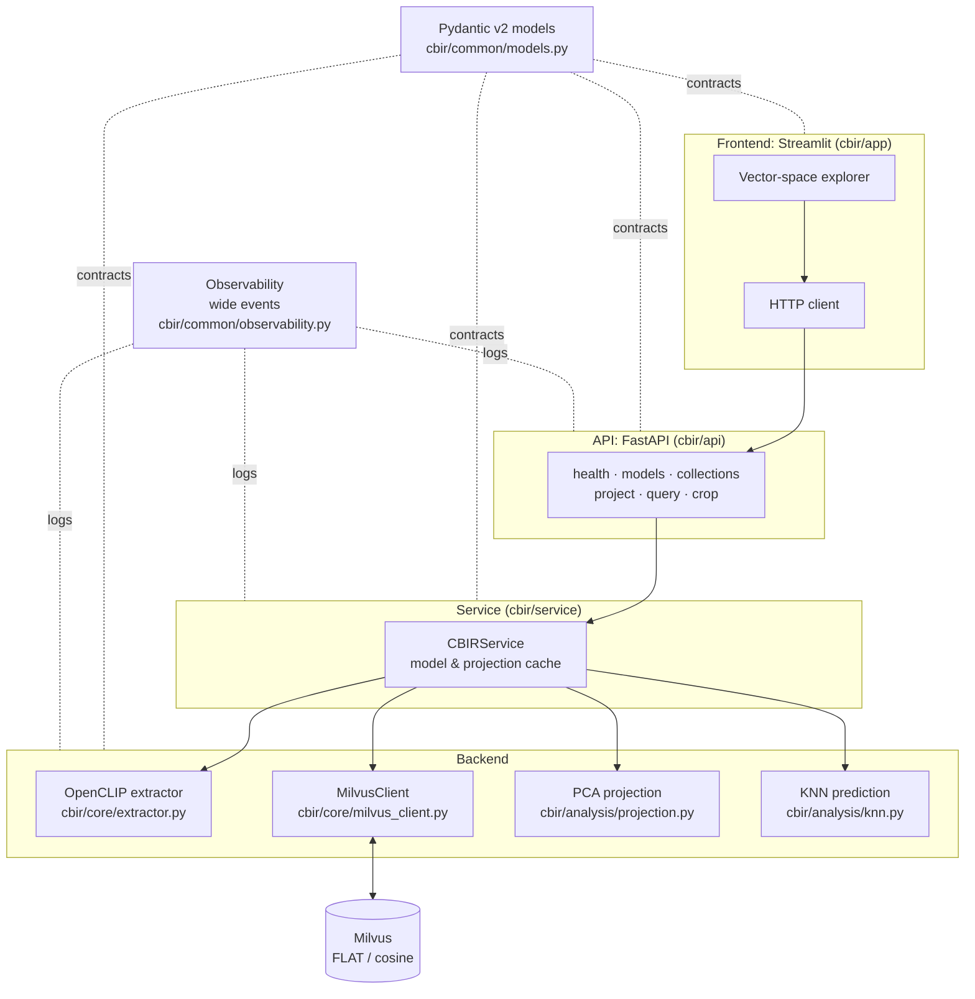
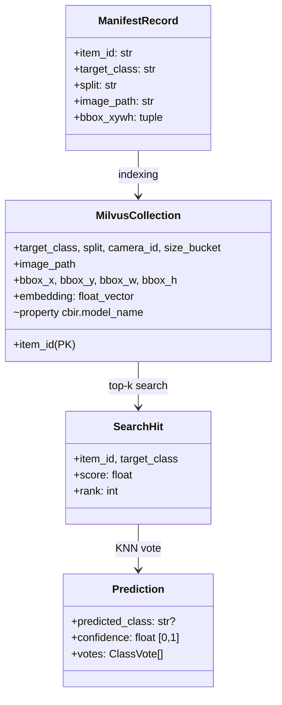
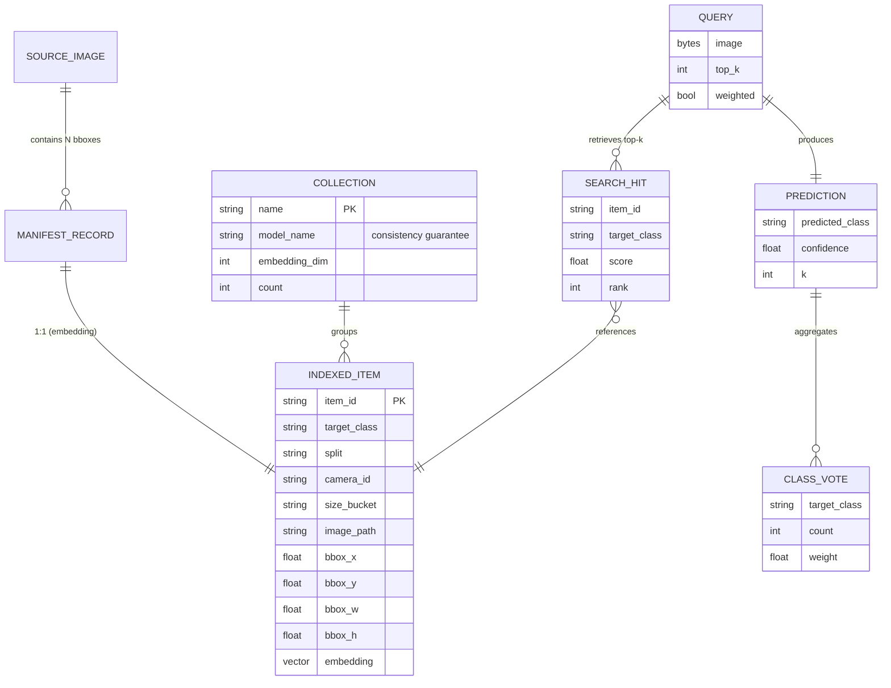
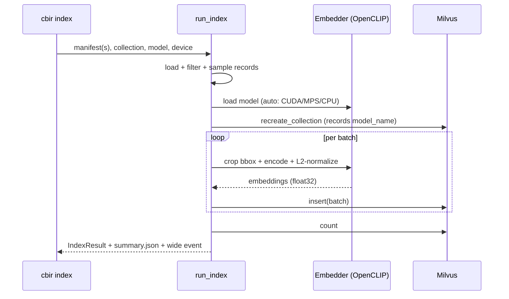
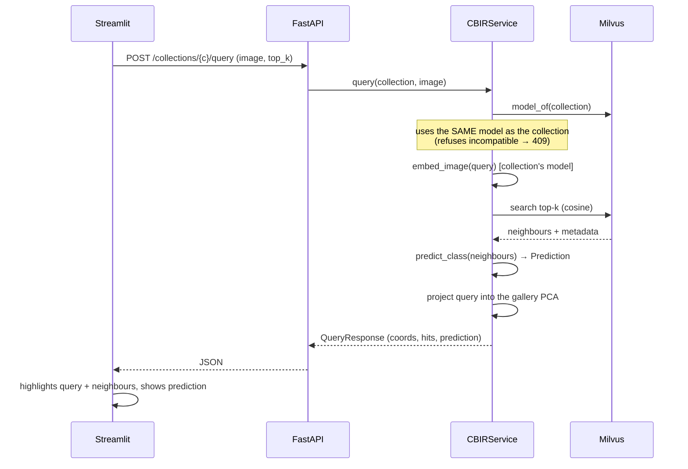
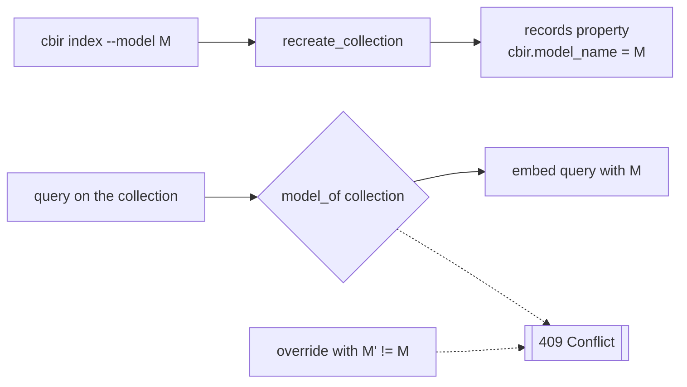
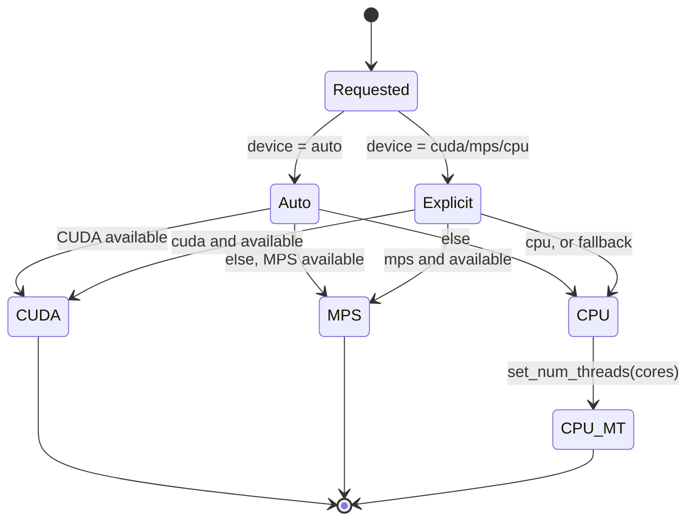
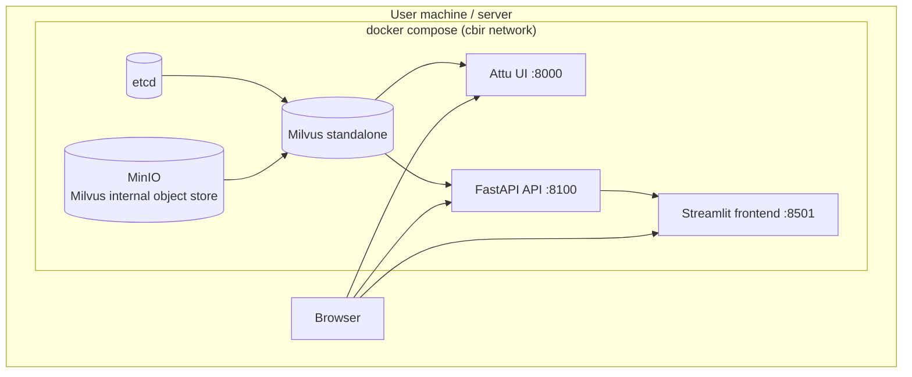

# Vector-Space Explorer for Images

**Programming Final Project (INF2102), PUC-Rio**
**Student:** Gabriel Ribeiro Gomes (ggomes@inf.puc-rio.br)
**Advisor:** Alberto Barbosa Raposo (abraposo@inf.puc-rio.br)
**Keywords:** content-based image retrieval, image embeddings, vector database, PCA, K-Nearest Neighbors, automatic labeling.

> **Case study and sample data:** the system is generic and works with any
> image. The sample set used in the demonstrations comes from a vessel-monitoring
> project in Guanabara Bay (TecGraf PUC-Rio / Embraer), but nothing in the system
> is specific to that domain.

---

## What is Content-Based Image Retrieval (CBIR)

Content-Based Image Retrieval (CBIR) is the task of searching for images similar
to a query image using the *visual content itself*, rather than associated text,
tags, or metadata [1]. The core idea: convert each image into a numeric vector (an
*embedding*) that captures its visual features, so that similar images end up
close together in a vector space and different images end up far apart.
Similarity search then becomes a nearest-neighbour search in that space.

This matters for several practical and research reasons:

- **Label-free search:** it lets you find relevant images even when there is no
  textual description, which is common in large unannotated collections.
- **Automatic labeling:** if a new image falls near a cluster of images of a
  known class, a label can be proposed for it. This is the principle that
  motivates this work and the associated dissertation.
- **Evaluating representations:** the quality of an *embedding* can be judged by
  how well it groups images of the same class and separates different classes.

The central challenge of the field is obtaining representations (embeddings)
that capture *semantic* similarity, not just pixel similarity: two photos of the
same object under different angles or lighting should end up close together.
Modern vision models (such as CLIP) [2] produce strong generic embeddings, and an
important part of CBIR research is precisely measuring how reliable those
embeddings are for a concrete task. This program serves exactly that purpose:
making retrieval behaviour visible and measurable.

---

## Brief Description

The **Vector-Space Explorer for Images** is a content-based image retrieval
tool. It indexes image *embeddings* into a vector database and lets you
**explore the representation space visually**: it projects the indexed gallery
to 2D/3D with PCA, accepts a query image, and shows where it lands relative to
each class cluster. In addition, via a K-Nearest-Neighbors (KNN) [3] vote over the
retrieved neighbours, it predicts which class the queried image would belong to,
with a confidence score.

**Main functions the program offers:**

| Function | Description |
| --- | --- |
| Indexing | Extracts *embeddings* of image crops with a selectable model and stores them in Milvus. |
| Projection | Reduces the gallery *embeddings* to 2D/3D with PCA for visualization. |
| Visual query | Projects a new image into the *same* space as the gallery and highlights its nearest neighbours. |
| Class prediction | Votes, via KNN, the class of the queried image and reports confidence. |
| Reproducible snapshot | Exports/reconstructs a collection from an *embedding* cache (no GPU). |

**Intended users:** researchers and students of *CBIR* / computer vision who
need to **visually check** whether the retrieval and classification of their
representations are coherent, rather than relying only on aggregate metrics.

**Nature of the program:** a functional utility tool (a mature proof of
concept), serving as the experimental basis for a master's dissertation on
retrieval-based automatic labeling.

**Usage caveat:** the program does **not** train models and is **not** a
production classifier. The KNN prediction is a *retrieval-based labeling
heuristic* whose reliability is precisely the object of study. The *embeddings*
come from a generic external model (OpenCLIP), not a domain-specialized one.

---

## Project Vision

This section presents four scenarios (two positive and two negative) that guide
the creator's intent and the user's interpretation.

### Positive Scenario 1: Confirming a coherent grouping

Marina, a CBIR researcher, wants to know whether a generic *embedding* cleanly
separates `Traineira` (fishing boat) crops from `Rebocador` (tugboat). She
indexes the sample gallery, opens the explorer, picks the 3D projection, and
sees four reasonably distinct colour clouds. She drops a `Rebocador` crop as the
query: the red point lands **inside** the `Rebocador` cloud, the 10 displayed
neighbours are all tugboats, and the prediction panel shows **"would be labeled
Rebocador (90% confidence)"**. Marina concludes, visually, that the
representation is adequate for that class in that size range.

> This scenario evokes the core functions: indexing, projection, query, and
> prediction. Note that Marina needed no aggregate metric: the answer came from
> the point's position and the neighbours' agreement.

### Positive Scenario 2: Swapping models with a consistency guarantee

Pedro suspects that smaller patches would capture small vessels better. He
re-indexes the same gallery with `openclip-vit-b-16` into a separate collection.
On opening the explorer and selecting that collection, the interface shows
**"embedding model: openclip-vit-b-16"** and guarantees that any query will be
*embedded* with that same model. Pedro compares the two projections side by side
and decides which model separates the classes better, with no risk of
comparing vectors from different spaces.

> This scenario evokes model swapping and the **consistency guarantee**: the
> collection "remembers" which model built it, and the system refuses to mix
> *embedding* spaces.

### Negative Scenario 1: Query with an incompatible model

Ana tries, via the API, to query a collection built with `openclip-vit-b-32`
while forcing the `openclip-vit-b-16` model. The system **refuses** the
operation with a `409 Conflict` and the message: *"the collection was built with
openclip-vit-b-32, but the query requested openclip-vit-b-16; the embeddings
would be incomparable"*.

> This scenario illustrates a **known and intended** limitation: distances
> between vectors from different models are meaningless. The program prefers to
> fail clearly rather than silently return an incorrect result. There is no way
> around it through the interface, and that is by design.

### Negative Scenario 2: Misclassified ambiguous crop

João queries with a small, distant `Traineira` crop captured in the background
of a scene. The query point lands on the boundary between `Traineira` and
`Navio de Carga Geral` (general cargo ship), and the KNN prediction returns
**"Navio de Carga Geral"** with high confidence (a mistake). On inspecting the
displayed neighbours, João realizes they are all small, distant vessels from the
same camera: visually alike, just a few pixels.

> This scenario exposes a different limitation from the previous one: for very
> small objects, the generic *embedding* captures the scene context more than
> the object itself. The program does not hide this; on the contrary, the tool
> **exists precisely to make this kind of failure visible**, which is a research
> result, not a software defect.

---

## Technical Documentation

### Architecture Model

The system is organized into three layers with a one-directional dependency
(*frontend* → API → *backend*), plus shared data contracts and observability.



### Data Model

The canonical unit is the **bounding-box crop**. A *manifest* (JSONL, one record
per box) describes each item; the crop is derived at runtime. Embeddings and
metadata are persisted in Milvus.



The entity-relationship diagram below details the persisted entities and their
cardinalities. A source image contains many boxes; each box becomes an indexed
item; each query produces many neighbours, which feed one prediction.



The metadata schema stored with each vector was chosen to be exactly what the
*frontend* needs:

| Field | Use |
| --- | --- |
| `target_class` | Point colour in the chart and KNN vote |
| `split`, `camera_id`, `size_bucket` | Facets / hover |
| `image_path` | Serving the crop as a thumbnail |
| `bbox_x..h` | Reconstructing the crop when needed |
| `embedding` | Vector for cosine search |
| _property_ `cbir.model_name` | **Model-consistency guarantee** |

### Indexing Flow



### Query Flow (the heart of the tool)



### Fundamentals: PCA and dimensionality reduction

Each *embedding* produced by the model is a high-dimensional vector (in the case
of OpenCLIP ViT-B/32, 512 dimensions). This space is what allows similarity to
be measured precisely, but it is **impossible to visualize directly**: there is
no way to draw a point on 512 axes. To inspect the space with the naked eye we
must project it into 2 or 3 dimensions, accepting that *part of the information
will be lost* in that compression. It is a deliberate trade-off: we exchange
fidelity for visual interpretability.

Principal Component Analysis (PCA) [4] performs this reduction by seeking the
directions of *greatest variance* in the data. Given a matrix `X` (n centred
embeddings, with zero mean), PCA computes the covariance matrix
`C = (1/n) Xᵀ X` and solves its eigenvalue problem `C·vᵢ = λᵢ·vᵢ`. The
eigenvectors `vᵢ` (the principal components) are orthogonal and ordered by the
eigenvalues `λᵢ`, which measure how much variance each direction captures. To
visualize in `k` dimensions (`k = 2` or `3`), we take the `k` eigenvectors with
the largest eigenvalues, forming `Wₖ`, and project `Z = X·Wₖ`. The fraction of
variance preserved is `(λ₁ + ... + λₖ) / (λ₁ + ... + λ_d)`; the interface report
shows this value to make explicit how much was lost. Being a *linear*
transformation, PCA projects a new query image into the same space with the same
multiplication `z = x·Wₖ`, which is the essential property for positioning the
query relative to the existing clusters. The geometric intuition in two
dimensions: the first principal component (`v₁`) points in the direction of
greatest spread of the data, and the second (`v₂`), orthogonal to it, in the
direction of greatest remaining variance.

### Why PCA (and not t-SNE/UMAP) for the projection

The projection uses Principal Component Analysis (PCA) [4], a linear
dimensionality reduction. The alternatives would be non-linear methods such as
t-SNE [5] or UMAP [6], but they do not offer an exact transform to project a new
point (the query) into the same space as the already-fitted gallery.

| Criterion | PCA | t-SNE / UMAP |
| --- | --- | --- |
| Project a **new** query into the same space | Exact and cheap (`transform`) | No exact `transform` for unseen points |
| Determinism | Yes | Stochastic |
| Preserves global distances | Yes (linear) | Focuses on local structure |
| Suited to "where does my query fall vs. clusters" | **Ideal** | Misleading for absolute placement |

The choice of PCA is what makes the program's central question well-posed:
*where does this new image fall relative to the existing clusters?* This
requires applying exactly the same linear transform to the query and the
gallery.

### The model-consistency guarantee



Vectors from different models live in distinct spaces; comparing their distances
is meaningless. The system records the model on the collection and **always**
embeds the query with it, refusing any attempt to mix spaces.

### Device resolution (auto → CUDA → MPS → CPU)

The system picks the best available accelerator and degrades gracefully, so the
*same* command runs on any machine.



### Deployment diagram (Docker Compose)



The default profile brings up only the Milvus stack (`docker compose up -d`);
the `app` profile adds the API and frontend (`docker compose --profile app up -d`).

### About the code

The main technologies used, with a brief explanation of each:

- **Python 3.13** with **uv**: the project language and its dependency/environment
  manager (fast, with a reproducible *lockfile*).
- **OpenCLIP** [7]: an open implementation of the CLIP model, which turns an image
  into a vector (*embedding*) that captures its visual content.
- **Milvus** [8]: a vector database, specialized in storing *embeddings* and running
  nearest-neighbour search at scale.
- **scikit-learn (PCA)** [9]: a *machine learning* library; we use PCA to reduce the
  vectors to 2D/3D while preserving the directions of greatest variance.
- **FastAPI**: a Python web *framework* for APIs, with automatic validation and
  documentation; it exposes the *backend* over HTTP.
- **Streamlit** with **Plotly**: Streamlit builds the web interface in pure
  Python; Plotly draws the interactive 2D/3D scatter plots.
- **Pydantic v2**: validates and types the data flowing between layers, ensuring
  they all agree on the shape.
- **ruff**, **mypy**, **pytest**: linter/formatter, static type checker, and test
  *framework*, respectively.
- **Docker Compose**: orchestrates the services (Milvus, API, interface) in
  containers, to bring everything up with one command.

The table below summarizes the implementation decisions:

| Aspect | Decision |
| --- | --- |
| Language | Python 3.13, managed with `uv` |
| Data contracts | Pydantic v2 (validation at layer boundaries) |
| Extraction | OpenCLIP; runtime crop; L2 normalization |
| Vector DB | Milvus *standalone* (FLAT index, cosine metric) |
| Projection | scikit-learn PCA (2D/3D), with graceful degradation |
| API | FastAPI (thin endpoints over the service) |
| Frontend | Streamlit + Plotly (talks only to the API) |
| *Device* | `auto`: CUDA → Apple MPS → multi-thread CPU |
| Observability | stdlib `logging` with *wide events* (one event per operation) |
| Quality | `ruff` (lint), `mypy` (types), `pytest` (tests) |

**Commenting strategy:** *docstrings* explain the *intent* and *why* of each
module/function; inline comments flag non-obvious decisions (e.g., why negative
similarity is not subtracted from a vote, why PCA rather than UMAP). Obvious code
is not commented.

---

## Tests

The suite has **33 tests** and is designed to be fast and deterministic: the
*backend* is pure and tested without Milvus or *torch*, and the API is tested
with a fake service (a stub), which removes any external dependency and still
lets us verify the model-consistency guarantee (the `409` response). The tests
run in a few seconds.

| File | What it covers | Count |
| --- | --- | ---: |
| `test_knn.py` | KNN vote: empty set, unanimity, majority vs. weighted vote, `k` cutoff, negative similarity not subtracting evidence, deterministic tie-breaking | 7 |
| `test_manifest.py` | Data contract: duplicate `item_id` rejection, required fields, split/benchmark filters, deterministic per-class sampling, bbox crop clipped to image bounds | 7 |
| `test_projection.py` | PCA: requested dimensionality, `transform` reproduces the gallery (the basis for projecting the query), single vector, graceful degradation, empty gallery, determinism | 6 |
| `test_api.py` | HTTP contract: `health`, collections with their model, projection and 404, happy-path query with prediction, invalid upload rejected | 6 |
| `test_models.py` | Pydantic models: confidence bounds, positive `rank`, `model_*` fields, JSON round-trip | 4 |
| `test_scatter.py` | Plotly 2D/3D frontend figure construction, including query and highlighted neighbours | 3 |

Illustrative snippet (the similarity-weighted vote can flip the winner relative
to a plain majority):

```python
def test_weighted_vote_can_flip_the_winner() -> None:
    hits = [
        _hit("a", "Traineira", 0.30, 1),
        _hit("b", "Traineira", 0.31, 2),
        _hit("c", "Lancha", 0.99, 3),
    ]
    pred = predict_class(hits, weighted=True)
    assert pred.predicted_class == "Lancha"
    assert abs(pred.confidence - 0.99 / 1.60) < 1e-6
```

Full run (all three checks must be green):

```bash
uv run ruff check cbir/ tests/   # lint
uv run mypy cbir/                # types
uv run pytest                    # 33 tests
```

---

## User Manual

The manual covers the two intended user types: those who want to **run the
demo** quickly and those who want to **index their own data**.

### Installation

```text
Instruction Guide:
%%%%%%%%%%%%%%%%%%%
Step 1: uv sync                 # install dependencies
Step 2: docker compose up -d    # start Milvus (etcd + minio + milvus + Attu)
Step 3: wait until Milvus is "healthy" (docker compose ps)
```

### Task A: Run the demo (no GPU, no model download)

```text
Instruction Guide:
%%%%%%%%%%%%%%%%%%%
Step 1: uv run cbir seed --collection cbir_sample \
             --parquet cbir/sample_data/embeddings.parquet
Step 2: uv run cbir api        # terminal 1: API on :8100
Step 3: uv run cbir app        # terminal 2: frontend on :8501
Step 4: open http://localhost:8501, choose the "cbir_sample" collection
Step 5: upload a crop from cbir/sample_data/crops/ as the query

  >>> Alternative (Docker, full stack):
      docker compose --profile app up -d --build
      docker compose exec api cbir seed --collection cbir_sample

Exceptions or potential problems:
%%%%%%%%%%%%%%%%%%%%%%%%%%%%%%%%%%
If [the API replies "API not reachable"]
    {
    Then do: confirm `cbir api` is running and port 8100 is free
    }
If [the chart appears empty]
    {
    Then do: run `cbir seed` before opening the app; the collection must exist
    }
```

### Task B: Index your own data

```text
Instruction Guide:
%%%%%%%%%%%%%%%%%%%
Step 1: have/produce a manifest.jsonl (one record per bbox)
Step 2: uv run cbir index --manifest <path> --collection <name> \
             --model openclip-vit-b-32 --device auto
Step 3: (optional) uv run cbir export --collection <name> \
             --model openclip-vit-b-32   # reproducible snapshot
Step 4: open the frontend and select the new collection

  >>> To swap models, use --model openclip-vit-b-16 and a different collection
  >>> name. The collection stores its model; the query will use the same one.

Exceptions or potential problems:
%%%%%%%%%%%%%%%%%%%%%%%%%%%%%%%%%%
If [Condition: "No records selected"]
    {
    Then do: review --split / --benchmark-only / --per-class
    }
If [Condition: query refused with 409]
    It is because: the collection was built with another model; use the collection's model
```

### Command reference

| Command | What it does |
| --- | --- |
| `cbir sample` | Builds the committable sample dataset (crops + manifest) |
| `cbir index` | Extracts *embeddings* from a manifest and indexes into Milvus |
| `cbir export` | Exports a collection's *embeddings* to a Parquet cache |
| `cbir seed` | Reconstructs a collection from a Parquet cache (no model) |
| `cbir api` | Starts the FastAPI service |
| `cbir app` | Starts the Streamlit *frontend* |

### API endpoints

| Method | Route | Function |
| --- | --- | --- |
| GET | `/health` | Liveness check |
| GET | `/models` | Available *embedding* models |
| GET | `/collections` | Indexed collections + model + count |
| GET | `/collections/{n}/project?n_components=2\|3` | Gallery PCA coordinates |
| POST | `/collections/{n}/query` | Image → neighbours + KNN prediction + coords |
| GET | `/crop?image_path=...` | Serves a crop by manifest path |

---

## Verification

The system was validated end to end on the development machine (Apple Silicon,
`mps` device):

| Check | Result |
| --- | --- |
| Sample indexing (160 crops, 4 classes) | 160 items in ~29 s (MPS) |
| Gallery 2D/3D PCA projection | 160 points, exact query `transform` |
| End-to-end query (upload → search → KNN → projection) | Prediction consistent with confidence |
| Model-consistency guarantee | Refusal (409) confirmed in tests |
| `ruff` / `mypy` / `pytest` | Clean / clean / 33 tests passing |
| Reconstruction via cache (`seed`) | Collection recreated in ~3 s without model/GPU |

**Note on visualization scale.** The verification used 160 vectors. The tool's
practical bottleneck is neither Milvus nor PCA, but browser rendering: Plotly
draws the points as SVG by default, which keeps interaction (3D rotation,
*hover*, *zoom*) fluid up to the order of a few thousand points and starts to
degrade beyond that. Scaling to tens of thousands would require switching to
WebGL rendering (`Scattergl`, which supports ~100k points) or sampling/aggregating
the gallery before plotting. These are expected limits of the rendering approach,
not measurements of this project, and remain natural future work.

_Date: _[to fill in]_ (repository: `cbir/`)._

---

## Demonstration

This section shows the interface in use, captured over the sample collection (`cbir_sample`, 160 crops from 4 vessel classes).

The home screen shows the gallery projected to 2D with PCA and coloured by class, with the controls sidebar and the cumulative explained variance shown at the top.


The controls panel lets you select the collection (with its associated embedding model), the 2D/3D projection, the number of neighbours k, and the similarity-weighted vote.


When you upload a query image, the tool projects it into the same space (red diamond), highlights the retrieved neighbours (yellow), and predicts the class by KNN vote. Below, the query (a Traineira crop) lands near other fishing boats, the prediction panel reports Traineira with 70% confidence, and the bottom strip lists the ten nearest neighbours with their scores.


The same query in the 3D projection:


The API exposes interactive documentation generated automatically by FastAPI, with all endpoints and the data schemas derived from the Pydantic models.


---

## References

1. Smeulders et al. "Content-Based Image Retrieval at the End of the Early Years." IEEE TPAMI 22(12), 2000. DOI:[10.1109/34.895972](https://doi.org/10.1109/34.895972)
2. Radford et al. "Learning Transferable Visual Models From Natural Language Supervision." ICML 2021.
3. Cover & Hart. "Nearest Neighbor Pattern Classification." IEEE Trans. Information Theory 13(1), 1967. DOI:[10.1109/TIT.1967.1053964](https://doi.org/10.1109/TIT.1967.1053964)
4. Jolliffe. "Principal Component Analysis." 2nd ed., Springer, 2002.
5. van der Maaten & Hinton. "Visualizing Data using t-SNE." JMLR 9, 2008.
6. McInnes, Healy & Melville. "UMAP: Uniform Manifold Approximation and Projection for Dimension Reduction." [arXiv:1802.03426](https://arxiv.org/abs/1802.03426), 2018.
7. Ilharco et al. "OpenCLIP." 2021. DOI:[10.5281/zenodo.5143773](https://doi.org/10.5281/zenodo.5143773). <https://github.com/mlfoundations/open_clip>
8. Wang et al. "Milvus: A Purpose-Built Vector Data Management System." SIGMOD 2021. DOI:[10.1145/3448016.3457550](https://doi.org/10.1145/3448016.3457550)
9. Pedregosa et al. "Scikit-learn: Machine Learning in Python." JMLR 12, 2011.
